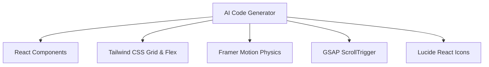

<div align="center">

# ⚡ VibeFlow UI — Premium AI Prompt Library & Design System

### The absolute largest open-source collection of production-ready, hyper-fidelity AI web design prompts — **339 prompts and growing.**

[](LICENSE)
[](https://github.com/nomaan5541/motionsites-prompt-collection/stargazers)
[](https://github.com/nomaan5541/motionsites-prompt-collection/network/members)
[](https://github.com/nomaan5541/motionsites-prompt-collection/issues)
[](CONTRIBUTING.md)

**339 free, production-ready AI prompts** that generate stunning landing pages, hero sections, and web components. Copy a prompt → Paste into your AI tool → Get a pixel-perfect design in seconds.

[🌐 **Browse the Live Library**](https://vibeflowui.vercel.app/) · [⭐ **Star this repo**](#-support-this-project) · [🤝 **Contribute**](CONTRIBUTING.md) · [📄 **License**](LICENSE)

</div>

---

## 📖 Table of Contents
1. [🚀 Overview & Vision](#-overview--vision)
2. [✨ Key Features & Capabilities](#-key-features--capabilities)
3. [📂 Repository Architecture](#-repository-architecture)
4. [🧑‍💻 Under the Hood: Prompt Engineering Anatomy](#-under-the-hood-prompt-engineering-anatomy)
5. [🖥️ Interactive Gallery Design System](#-interactive-gallery-design-system)
6. [🛠️ Technical Stack Generated](#-technical-stack-generated)
7. [🎯 Step-by-Step AI Generation Playbook](#-step-by-step-ai-generation-playbook)
8. [🎛️ Local CLI Tool Reference](#-local-cli-tool-reference)
9. [📚 Exhaustive Categories Directory](#-exhaustive-categories-directory)
10. [📝 Detailed Prompt Catalog](#-detailed-prompt-catalog)
11. [🤝 Contribution Guidelines & Style Guide](#-contribution-guidelines--style-guide)
12. [⚖️ Legal, Licensing & Fictional Disclaimer](#-legal-licensing--fictional-disclaimer)
13. [🔗 Connection & Community](#-connection--community)

---

## 🚀 Overview & Vision

Modern AI code generation tools (such as **Bolt.new**, **v0.dev**, **GPT-Engineer**, and **Lovable.dev**) are extremely powerful, but they share a common limitation: **they generate standard, generic, and uninspired layouts unless explicitly fed detailed layout instructions.** Without high-fidelity styling specifications, AI models fallback to vanilla Tailwind cards, plain grids, basic system fonts, and generic spacing.

**VibeFlow UI** solves this limitation by acting as a **layout compiler and design system specification layer**. It provides **339 highly structured design system prompts** written in Markdown, which enforce precise spacing, advanced typography scales, customized color variables, and interactive physics-based animation hooks (Framer Motion and GSAP).

Our mission is to democratize elite frontend design. By translating premium Awwwards-level layouts into structured text instructions, anyone can generate beautiful motion-intensive websites in a single prompt run.

---

## ✨ Key Features & Capabilities

- **339 Curated Designs**: The library contains templates and component sections covering all major web design trends (Neo-brutalism, Glassmorphism, Space minimalism, Dark Editorial, etc.).
- **Vivid Screenshot Previews**: The live gallery cards dynamically fetch web screenshots via DigitalOcean Spaces CDN, giving you an immediate visual representation of what the prompt produces.
- **Autoplay Hover Previews**: Card visual containers are hooked into a custom mouseover playback manager that starts video loops on hover and immediately pauses them on mouseleave to avoid rendering threads blocking.
- **Physics-Based Card Tilt**: Interactive grid cards feature a responsive 3D card tilt effect calculated dynamically using cursor page coordinates and spring-back transitions.
- **Full Text Prompts in the Repository**: Unlike libraries that only host metadata, every prompt's raw, un-truncated markdown code is stored in the repository.
- **Bonus Premium Prompts Extracted**: Includes 66 premium template configurations extracted and fully mapped to markdown files.
- **Community-Sourced Collection**: Incorporates 113 additional prompts sourced from the open-source community, expanding the library to 339 total prompts.

---

## 📂 Repository Architecture

Here is the folder structure of the VibeFlow UI workspace:

```
motionsites-prompt-collection/
├── .github/                   # GitHub issues templates & workflows
├── assets/                    # Static preview assets
│   ├── images/                # GIF previews
│   └── videos/                # Autoplay webm/mp4 preview video loops
├── bin/                       # Local CLI executable scripts
│   └── index.js               # CLI interface router code
├── demos/                     # Local interactive preview stubs
│   ├── Aethera_Studio/        # Preview stubs for each design name
│   │   └── index.html         # Glassmorphic prompt viewer & copy tool
│   └── ...                    # 159+ additional design folders
├── Pro prompts/               # 66 Premium system prompts
│   └── ...
├── prompts/                   # 273 Free system prompts
│   └── ...
├── index.html                 # Main library interactive interface
├── vercel.json                # Vercel configuration & redirect headers
├── package.json               # Node dependency mappings and CLI bindings
├── README.md                  # Comprehensive documentation
├── LICENSE                    # MIT license agreement
├── DISCLAIMER.md              # Fictional assets notice
└── SECURITY.md                # Responsible vulnerability disclosure
```

---

## 🧑‍💻 Under the Hood: Prompt Engineering Anatomy

Every prompt file inside `prompts/` and `Pro prompts/` is formatted with metadata parameters followed by a heavily structured system instruction sheet.

### Markdown Schema
```markdown
---
title: "Luxury Real Estate"
category: Templates
subCategory: Real-estate
premium: false
imageUrl: https://strvid.nyc3.cdn.digitaloceanspaces.com/motionitems/1780826949672-Luxonn.webp
---

# Luxury Real Estate
```

### The System Prompt Engineering Structure
Our prompts are built around a strict engineering structure to guarantee consistency across different AI models:

1. **Role Definition**: Establishing the persona (e.g. *"Act as an award-winning UI/UX designer and elite React Frontend Developer..."*).
2. **Typography Constraints**: Forcing serif headlines (e.g., `Playfair Display`, `Cormorant Garamond`) combined with clean sans-serif bodies (e.g., `Plus Jakarta Sans`, `Inter`).
3. **HSL Color Tokens**: Forcing consistent custom colors using Tailwind variables (e.g., primary `bg-[#030305]`, glowing gold accent `text-[#d4af37]`).
4. **Spacing & Layouts**: Enforcing wide padding, clean flex/grid headers, overlapping visual sections, and custom borders.
5. **Animation Physics (Framer Motion)**:
   - Defining spring constants: `transition: { type: "spring", stiffness: 100, damping: 20 }`
   - Defining orchestrators: `staggerChildren: 0.1`
6. **GSAP Timelines**: Custom setup guides for ScrollTrigger to pin hero elements and trigger horizontal page translations.

---

## 🖥️ Interactive Gallery Design System

The library's web interface [index.html](file:///f:/vibeflowui.com-main/index.html) is built as a dark space-themed gallery using a custom design system:

### 1. The Space Canvas Starfield
An interactive starfield background renders animated, floating star grids combined with glowing blur orbs. The radial gradients rotate slowly across the screen, simulating a nebula.

### 2. 3D Card Hover Tilt Algorithm
Cards react to mouse movements using local coordinates:
```javascript
const rect = card.getBoundingClientRect();
const x = e.clientX - rect.left;
const y = e.clientY - rect.top;
const centerX = rect.width / 2;
const centerY = rect.height / 2;
const rotateX = -(y - centerY) / 15;
const rotateY = (x - centerX) / 15;
card.style.transform = `rotateX(${rotateX}deg) rotateY(${rotateY}deg) translateY(-4px)`;
```
This produces a smooth tilt rotation that tracks the user's cursor.

### 3. Autoplay Hover Previews
Card previews use a combination of lazy-loaded `.webp` screenshot images and dynamic `.mp4`/`.webm` preview loops:
- The preview image covers the card initially.
- On hover, the `preview-video` plays and rises above the screenshot layer.
- On mouseleave, the video immediately pauses to release processor cycles.

---

## 🛠️ Technical Stack Generated

Prompts instruct the generator to output code strictly targeting the following frontend libraries:



- **Framer Motion Constants**:
  - Fade-up: `{ opacity: 0, y: 30 }` to `{ opacity: 1, y: 0 }`
  - Scale spring: `{ scale: 0.95 }` to `{ scale: 1 }`
- **GSAP Scroll Pins**:
  - For sections requiring deep scroll interactions, animations are bound directly to `scrollY` coordinates.

---

## 🎯 Step-by-Step AI Generation Playbook

Follow these steps to generate high-fidelity interfaces using the library:

1. **Select a Design**: Go to the web app gallery and select a template or section that matches your project requirements.
2. **Copy the Prompt**: Click the `Code` button to open the preview modal and copy the text.
3. **Open AI Developer Environment**:
   - **Bolt.new**: Excellent for complete, operational React/Vite development.
   - **v0.dev**: Ideal for visual React component blocks.
   - **GPT-Engineer / Lovable**: Great for database-backed web applications.
4. **Input the Prompt**: Paste the prompt. Add your custom branding instructions if needed (e.g. *"Modify this layout to use blue branding colors instead of gold"*).
5. **Generate & Iterate**: Let the AI compile the design framework, then perform visual modifications as needed.

---

## 🎛️ Local CLI Tool Reference

The CLI utility allows developers to inspect all available prompt names locally from their terminal:

### Installation
```bash
# Link the CLI locally
npm link
```

### Usage Commands
```bash
# List all prompts in both 'prompts/' and 'Pro prompts/'
npx templateprompts list

# Display helper documentation
npx templateprompts help
```

---

## 📚 Exhaustive Categories Directory

We partition our designs into 19 categories representing specific web page layout needs:

- 💻 **SaaS**: High-converting homepages, app dashboards, feature cards, metrics charts, and table views.
- 🎨 **Agency**: High-end typography, horizontal layouts, floating image grids, and creative project cases.
- 👤 **Portfolio**: Designer grids, neon resumes, interactive project timelines, and contact pages.
- 💳 **Fintech**: Sleek tables, dark glass transaction panels, and crypto exchange grids.
- 🌐 **Web3**: Futuristic cyber-themes, NFT galleries, neon borders, and decentralized app states.
- 🛍️ **E-commerce**: Clean digital storefront grids, product detail previews, and minimal carts.
- 🚙 **Automotive**: Dynamic vehicle galleries, full-screen slider folds, and specifications tables.
- 🏔️ **Resort**: Eco-lodge showcases, serene earthy HSL colors, room slider templates, and booking cards.
- 🍽️ **Restaurant**: Premium food menus, dark reservation overlays, and glowing culinary showcases.
- 🎒 **Courses**: Online learning homepages, chapter accordions, and interactive syllabus grids.
- 🛋️ **Interiors**: Interior design slideshows, large architectural grids, and project portfolios.
- 🏛️ **Corporate**: Classic, clean corporate layouts with strict structural headers and grid metrics.
- 🎯 **Hero Sections**: High-fidelity landing folds featuring complex scroll-tied animations.
- 💸 **Pricing Tables**: Grid card systems with neon headers and active option indicators.
- ⚙️ **Features Sections**: Dynamic hover tabs, hover details, and interactive grids.
- 💬 **Testimonial Slider**: Auto-marquee columns and card carousels.
- 📑 **Footers**: Creative custom footer menus and social grids.
- ❓ **FAQ Accordions**: Expandable card components utilizing clean spring motion.

---

## 📝 Complete Prompt Catalog (339 Prompts)

Below is the full list of every prompt in the library.

### 📁 `prompts/` — 273 Prompts

| # | Prompt Name | File |
|---|---|---|
| 1 | 3D Animation Hero | `prompts/3D_Animation_Hero.md` |
| 2 | 3D Collectible Hero | `prompts/3D_Collectible_Hero.md` |
| 3 | 3D Jack Portfolio | `prompts/3D_Jack_Portfolio.md` |
| 4 | Acreage Farming | `prompts/Acreage_Farming.md` |
| 5 | Adeora Hero | `prompts/Adeora_Hero.md` |
| 6 | Aetheris Voyage | `prompts/Aetheris_Voyage.md` |
| 7 | Aethera Studio | `prompts/Aethera_Studio.md` |
| 8 | AI Automation | `prompts/AI_Automation.md` |
| 9 | AI Automation Hero | `prompts/AI_Automation_Hero.md` |
| 10 | AI Designer Agency | `prompts/AI_Designer_Agency.md` |
| 11 | AI Designer Portfolio | `prompts/AI_Designer_Portfolio.md` |
| 12 | AI Image Generator UI | `prompts/AI_Image_Generator_UI.md` |
| 13 | AI Workflow Hero | `prompts/AI_Workflow_Hero.md` |
| 14 | AKOR Security | `prompts/AKOR_Security.md` |
| 15 | Alto Hero | `prompts/Alto_Hero.md` |
| 16 | Apex SaaS | `prompts/Apex_SaaS.md` |
| 17 | Arise | `prompts/Arise.md` |
| 18 | Art Landing | `prompts/Art_Landing.md` |
| 19 | Ashley | `prompts/Ashley.md` |
| 20 | Asme | `prompts/Asme.md` |
| 21 | Assist Hero | `prompts/Assist_Hero.md` |
| 22 | Aura Hero | `prompts/Aura_Hero.md` |
| 23 | AuraMail | `prompts/AuraMail.md` |
| 24 | Aurora Onboard | `prompts/Aurora_Onboard.md` |
| 25 | Automation Machines | `prompts/Automation_Machines.md` |
| 26 | Bali | `prompts/Bali.md` |
| 27 | Basilico Restaurant | `prompts/Basilico_Restaurant.md` |
| 28 | Benefits Features | `prompts/Benefits_Features.md` |
| 29 | Bionova Biotech | `prompts/Bionova_Biotech.md` |
| 30 | Blog Showcase | `prompts/Blog_Showcase.md` |
| 31 | Bloomora Hero | `prompts/Bloomora_Hero.md` |
| 32 | Bold Portfolio | `prompts/Bold_Portfolio.md` |
| 33 | Book Hero | `prompts/Book_Hero.md` |
| 34 | BookedUp | `prompts/BookedUp.md` |
| 35 | Buzzentic | `prompts/Buzzentic.md` |
| 36 | Celestia | `prompts/Celestia.md` |
| 37 | Cinematic Landing Page | `prompts/Cinematic_Landing_Page.md` |
| 38 | ClearInvoice Hero | `prompts/ClearInvoice_Hero.md` |
| 39 | ClubX | `prompts/ClubX.md` |
| 40 | CoderCrest | `prompts/CoderCrest.md` |
| 41 | Community CTA | `prompts/Community_CTA.md` |
| 42 | Creative Agency | `prompts/Creative_Agency.md` |
| 43 | Creative Studio | `prompts/Creative_Studio.md` |
| 44 | Crypto Wealth | `prompts/Crypto_Wealth.md` |
| 45 | Cursor Follow | `prompts/Cursor_Follow.md` |
| 46 | Cybersecurity Hero | `prompts/Cybersecurity_Hero.md` |
| 47 | Cybersecurity Hero v2 | `prompts/Cybersecurity_Hero_v2.md` |
| 48 | Daisy Shop | `prompts/Daisy_Shop.md` |
| 49 | Dark Portfolio | `prompts/Dark_Portfolio.md` |
| 50 | Dashboard UI | `prompts/Dashboard_UI.md` |
| 51 | Datacore | `prompts/Datacore.md` |
| 52 | Deck Investor | `prompts/Deck_Investor.md` |
| 53 | Digital Epoch | `prompts/Digital_Epoch.md` |
| 54 | Digital Reality | `prompts/Digital_Reality.md` |
| 55 | Dot | `prompts/Dot.md` |
| 56 | Dreamcore Landing | `prompts/Dreamcore_Landing.md` |
| 57 | Duolingo Styleguide | `prompts/Duolingo_Styleguide.md` |
| 58 | E-commerce Website | `prompts/E_commerce_Website.md` |
| 59 | EcoVolta | `prompts/EcoVolta.md` |
| 60 | EcoVolta V2 | `prompts/EcoVolta_V2.md` |
| 61 | EMBER.dsgn | `prompts/EMBERdsgn.md` |
| 62 | Email Landing Page | `prompts/Email_Landing_Page.md` |
| 63 | Email Marketing | `prompts/Email_Marketing.md` |
| 64 | Equilibrium | `prompts/Equilibrium.md` |
| 65 | Evergreen Finance | `prompts/Evergreen_Finance.md` |
| 66 | Evr Ventures | `prompts/Evr_Ventures.md` |
| 67 | FAQ CTA | `prompts/FAQ_CTA.md` |
| 68 | Finlytic | `prompts/Finlytic.md` |
| 69 | FlowMate | `prompts/FlowMate.md` |
| 70 | Focus AI | `prompts/Focus_AI.md` |
| 71 | Foodly | `prompts/Foodly.md` |
| 72 | Footer - AxionX | `prompts/Footer_-_AxionX.md` |
| 73 | Footer - Devstream | `prompts/Footer_-_Devstream.md` |
| 74 | Footer - Elegant | `prompts/Footer_-_Elegant.md` |
| 75 | Footer - Grid | `prompts/Footer_-_Grid.md` |
| 76 | Footer - Horizon | `prompts/Footer_-_Horizon.md` |
| 77 | Footer - Layered | `prompts/Footer_-_Layered.md` |
| 78 | Footer - Minimal | `prompts/Footer_-_Minimal.md` |
| 79 | Footer - SkyReach | `prompts/Footer_-_SkyReach.md` |
| 80 | Framelix 3D | `prompts/Framelix_3D.md` |
| 81 | Futuristic Cinematic | `prompts/Futuristic_Cinematic.md` |
| 82 | Futuristic Tech | `prompts/Futuristic_Tech.md` |
| 83 | Glassmorphism Agency | `prompts/Glassmorphism_Agency.md` |
| 84 | Glow Features | `prompts/Glow_Features.md` |
| 85 | Grow AI | `prompts/Grow_AI.md` |
| 86 | Growth Marketing SaaS | `prompts/Growth_Marketing_SaaS.md` |
| 87 | Guardnet | `prompts/Guardnet.md` |
| 88 | HAUL! | `prompts/HAUL.md` |
| 89 | HR SaaS | `prompts/HR_SaaS.md` |
| 90 | Horizon Hero | `prompts/Horizon_Hero.md` |
| 91 | Impressive Hero | `prompts/Impressive_Hero.md` |
| 92 | Innovation | `prompts/Innovation.md` |
| 93 | Keep Ahead Features | `prompts/Keep_Ahead_Features.md` |
| 94 | Kresna Footer | `prompts/Kresna_Footer.md` |
| 95 | Layered Depth | `prompts/Layered_Depth.md` |
| 96 | Learnly | `prompts/Learnly.md` |
| 97 | Liquid Glass Agency | `prompts/Liquid_Glass_Agency.md` |
| 98 | Loader Animation | `prompts/Loader_Animation.md` |
| 99 | Logoisum | `prompts/Logoisum.md` |
| 100 | Lumina | `prompts/Lumina.md` |
| 101 | Luminex | `prompts/Luminex.md` |
| 102 | Luxury Ecommerce Design | `prompts/Luxury_Ecommerce_Design.md` |
| 103 | Luxury Watch | `prompts/luxury_watch.md` |
| 104 | Max Reed Portfolio | `prompts/Max_Reed_Portfolio.md` |
| 105 | Mave | `prompts/Mave.md` |
| 106 | Mindloop | `prompts/Mindloop.md` |
| 107 | Minimal Workflow SaaS | `prompts/Minimal_Workflow_SaaS.md` |
| 108 | Modern Agency | `prompts/Modern_Agency.md` |
| 109 | Modern HR Dashboard | `prompts/Modern_HR_Dashboard.md` |
| 110 | MotionZ Premium | `prompts/MotionZ_Premium.md` |
| 111 | My Portfolio | `prompts/My_portfolio.md` |
| 112 | Mythic Naturecore | `prompts/Mythic_Naturecore.md` |
| 113 | NOVA Space Systems | `prompts/NOVA_Space_Systems.md` |
| 114 | Naturally | `prompts/Naturally.md` |
| 115 | Nature Immersive Hero | `prompts/Nature_Immersive_Hero.md` |
| 116 | Naturecore SaaS | `prompts/Naturecore_SaaS.md` |
| 117 | NeoVision | `prompts/NeoVision.md` |
| 118 | Neo Museum | `prompts/Neo_Museum.md` |
| 119 | Neuralyn | `prompts/Neuralyn.md` |
| 120 | New Era Automotive Hero | `prompts/New_Era_Automotive_Hero.md` |
| 121 | New Era Bold Hero | `prompts/New_Era_Bold_Hero.md` |
| 122 | Nex Max Upgrade | `prompts/Nex_Max_Upgrade.md` |
| 123 | NexaCore | `prompts/NexaCore.md` |
| 124 | Nexar | `prompts/Nexar.md` |
| 125 | Nexora Automation | `prompts/Nexora_Automation.md` |
| 126 | Nexora Features | `prompts/Nexora_Features.md` |
| 127 | Nextgen | `prompts/Nextgen.md` |
| 128 | Nexto 404 | `prompts/Nexto_404.md` |
| 129 | Nexus IT Solutions | `prompts/Nexus_IT_Solutions.md` |
| 130 | Nickel Payments | `prompts/Nickel_Payments.md` |
| 131 | Nike Premium Landing | `prompts/Nike_Premium_Landing.md` |
| 132 | Nimbus Grid | `prompts/Nimbus_Grid.md` |
| 133 | Ninjas | `prompts/Ninjas.md` |
| 134 | No-Code Waitlist | `prompts/No_Code_Waitlist.md` |
| 135 | Northline | `prompts/Northline.md` |
| 136 | Northridge | `prompts/Northridge.md` |
| 137 | NovaDesk Signup | `prompts/NovaDesk_Signup.md` |
| 138 | Orbis NFT | `prompts/Orbis_NFT.md` |
| 139 | Orbit Engineers | `prompts/Orbit_Engineers.md` |
| 140 | Orbit Web3 | `prompts/Orbit_Web3.md` |
| 141 | Outbox | `prompts/Outbox.md` |
| 142 | Oynta | `prompts/Oynta.md` |
| 143 | Pinehaven | `prompts/Pinehaven.md` |
| 144 | Pixzen | `prompts/Pixzen.md` |
| 145 | Planet Orbit | `prompts/Planet_Orbit.md` |
| 146 | Portal | `prompts/Portal.md` |
| 147 | Portfolio Cosmic | `prompts/Portfolio_Cosmic.md` |
| 148 | Power AI | `prompts/Power_AI.md` |
| 149 | Price Calculator | `prompts/Price_Calculator.md` |
| 150 | Pricing - Brutalist | `prompts/Pricing_-_Brutalist.md` |
| 151 | Pricing - Cosmic | `prompts/Pricing_-_Cosmic.md` |
| 152 | Pricing - Luxury | `prompts/Pricing_-_Luxury.md` |
| 153 | Pricing - Predictable | `prompts/Pricing_-_Predictable.md` |
| 154 | Pricing - Radiant | `prompts/Pricing_-_Radiant.md` |
| 155 | Pricing - Stacked | `prompts/Pricing_-_Stacked.md` |
| 156 | Prioritize | `prompts/Prioritize.md` |
| 157 | Prism | `prompts/Prism.md` |
| 158 | Prisma Creative Studio | `prompts/Prisma_Creative_Studio.md` |
| 159 | Pro AI Deck | `prompts/Pro_AI_Deck.md` |
| 160 | Prosthetics Hero | `prompts/Prosthetics_Hero.md` |
| 161 | RIVR | `prompts/RIVR.md` |
| 162 | RIVR DeFi | `prompts/RIVR_DeFi.md` |
| 163 | Railroad.ai | `prompts/Railroad.ai.md` |
| 164 | Redge | `prompts/Redge.md` |
| 165 | Retro Futurist | `prompts/Retro_Futurist.md` |
| 166 | Reveal Hero | `prompts/Reveal_Hero.md` |
| 167 | Rootara Hero | `prompts/Rootara_Hero.md` |
| 168 | SAAS Software | `prompts/SAAS_Software.md` |
| 169 | SaaS Pricing Flow | `prompts/SaaS_Pricing_Flow.md` |
| 170 | Scenic Travel | `prompts/Scenic_Travel.md` |
| 171 | Scroll Landing Page | `prompts/Scroll_Landing_Page.md` |
| 172 | Securify Data Security | `prompts/Securify_Data_Security.md` |
| 173 | Sentinel AI | `prompts/Sentinel_AI.md` |
| 174 | Services - Cascade | `prompts/Services_-_Cascade.md` |
| 175 | Services - Corporate Edge | `prompts/Services_-_Corporate_Edge.md` |
| 176 | Services - Elegant | `prompts/Services_-_Elegant.md` |
| 177 | Services - Empower | `prompts/Services_-_Empower.md` |
| 178 | Services - Horizontal | `prompts/Services_-_Horizontal.md` |
| 179 | Services - Impact | `prompts/Services_-_Impact.md` |
| 180 | Services - Lumina | `prompts/Services_-_Lumina.md` |
| 181 | Shamoni | `prompts/Shamoni.md` |
| 182 | SkyElite Private Jets | `prompts/SkyElite_Private_Jets.md` |
| 183 | Skyway | `prompts/Skyway.md` |
| 184 | Slam Dunk | `prompts/Slam_Dunk.md` |
| 185 | Slate | `prompts/Slate.md` |
| 186 | Social Media Posts | `prompts/Social_Media_Posts.md` |
| 187 | Solar Energy Hero | `prompts/Solar_Energy_Hero.md` |
| 188 | Space Voyage | `prompts/Space_Voyage.md` |
| 189 | Spaceup | `prompts/Spaceup.md` |
| 190 | SpeakUp Venture Hero | `prompts/SpeakUp_Venture_Hero.md` |
| 191 | Stellar AI | `prompts/Stellar_AI.md` |
| 192 | Stellar Launch | `prompts/Stellar_Launch.md` |
| 193 | Synapse Dark Hero | `prompts/Synapse_Dark_Hero.md` |
| 194 | Sync AI | `prompts/Sync_AI.md` |
| 195 | Targo Logistics Hero | `prompts/Targo_Logistics_Hero.md` |
| 196 | Taskly | `prompts/Taskly.md` |
| 197 | Taskora SaaS Hero | `prompts/Taskora_SaaS_Hero.md` |
| 198 | Terra Geo Map | `prompts/Terra_Geo_Map.md` |
| 199 | Testimonials - Dual Marquee | `prompts/Testimonials_-_Dual_Marquee.md` |
| 200 | Testimonials - Pulse Slider | `prompts/Testimonials_-_Pulse_Slider.md` |
| 201 | Testimonials - Showcase | `prompts/Testimonials_-_Showcase.md` |
| 202 | Testimonials - Swing | `prompts/Testimonials_-_Swing.md` |
| 203 | Transform Data | `prompts/Transform_Data.md` |
| 204 | USD Halo | `prompts/USD_Halo.md` |
| 205 | Unmask Hero | `prompts/Unmask_Hero.md` |
| 206 | Urban Jungle | `prompts/Urban_Jungle.md` |
| 207 | VEX Ventures | `prompts/VEX_Ventures.md` |
| 208 | Valley | `prompts/Valley.md` |
| 209 | VaultShield | `prompts/VaultShield.md` |
| 210 | Veloce Finance | `prompts/Veloce_Finance.md` |
| 211 | Velorah | `prompts/Velorah.md` |
| 212 | Velorah Focus | `prompts/Velorah_Focus.md` |
| 213 | Velorix IIC | `prompts/Velorix_IIC.md` |
| 214 | VertexAI Hero | `prompts/VertexAI_Hero.md` |
| 215 | Viktor Portfolio | `prompts/Viktor_Portfolio.md` |
| 216 | Vinzo | `prompts/Vinzo.md` |
| 217 | Visual Hero | `prompts/Visual_Hero.md` |
| 218 | Vitara | `prompts/Vitara.md` |
| 219 | Vize Footer | `prompts/Vize_Footer.md` |
| 220 | WISA Space | `prompts/WISA_Space.md` |
| 221 | Waitlist Hero | `prompts/Waitlist_Hero.md` |
| 222 | Wander Hero | `prompts/Wander_Hero.md` |
| 223 | Wanderful Hero | `prompts/Wanderful_Hero.md` |
| 224 | Wealth Video Hero | `prompts/Wealth_Video_Hero.md` |
| 225 | Web3 EOS Hero | `prompts/Web3_EOS_Hero.md` |
| 226 | Weblex Dark Hero | `prompts/Weblex_Dark_Hero.md` |
| 227 | What Package Fits You | `prompts/What_Package_Fits_You.md` |
| 228 | Wnderly Travel | `prompts/Wnderly_Travel.md` |
| 229 | WorldView SaaS | `prompts/WorldView_SaaS.md` |
| 230 | Yacht Club | `prompts/Yacht_Club.md` |
| 231 | Zedian | `prompts/Zedian.md` |
| 232 | Zenith Footer | `prompts/Zenith_Footer.md` |
| 233 | Zenith Realty | `prompts/Zenith_Realty.md` |
| 234 | Élysian Hero | `prompts/Élysian_Hero.md` |
| 235 | xPortfolio Hero | `prompts/xPortfolio_Hero.md` |

> **Note:** Some filenames may vary slightly due to character encoding.

---

### 📁 `Pro prompts/` — 66 Premium Prompts

| # | Prompt Name | File |
|---|---|---|
| 1 | AI Automation Hero | `Pro prompts/AI Automation Hero.md` |
| 2 | Bold Portfolio Hero | `Pro prompts/Bold Portfolio Hero.md` |
| 3 | Buzzentic Agency | `Pro prompts/Buzzentic Agency.md` |
| 4 | ClearInvoice SaaS Hero | `Pro prompts/ClearInvoice SaaS Hero.md` |
| 5 | ClearInvoice SaaS Hero v2 | `Pro prompts/ClearInvoice SaaS Hero1.md` |
| 6 | Dark Portfolio Hero | `Pro prompts/Dark Portfolio Hero.md` |
| 7 | Datacore SaaS Hero | `Pro prompts/Datacore SaaS Hero.md` |
| 8 | Framelix 3D Studios | `Pro prompts/Framelix 3D Studios.md` |
| 9 | Glassmorphism Agency Hero | `Pro prompts/Glassmorphism Agency Hero.md` |
| 10 | HR SaaS Hero | `Pro prompts/HR SaaS Hero.md` |
| 11 | Loader Animation | `Pro prompts/Loader Animation.md` |
| 12 | Logoisum Video Agency | `Pro prompts/Logoisum Video Agency.md` |
| 13 | New Era Automotive Hero | `Pro prompts/New Era Automotive Hero.md` |
| 14 | New Era Bold Hero | `Pro prompts/New Era Bold Hero.md` |
| 15 | Space Voyage | `Pro prompts/Space Voyage.md` |
| 16 | Synapse Dark Hero | `Pro prompts/Synapse Dark Hero.md` |
| 17 | Targo Logistics Hero | `Pro prompts/Targo Logistics Hero.md` |
| 18 | Taskora SaaS Hero | `Pro prompts/Taskora SaaS Hero.md` |
| 19 | Viktor Portfolio | `Pro prompts/Viktor Portfolio.md` |
| 20 | Wealth Video Hero | `Pro prompts/Wealth Video Hero.md` |
| 21 | Web3 EOS Hero | `Pro prompts/Web3 EOS Hero.md` |
| 22 | Weblex Dark Hero | `Pro prompts/Weblex Dark Hero.md` |
| 23 | Acreage Farming Hero | `Pro prompts/acreage-farming-hero.md` |
| 24 | AI Designer Agency | `Pro prompts/ai-designer-agency.md` |
| 25 | AKOR Security Landing | `Pro prompts/akor-security-landing.md` |
| 26 | Apex SaaS Hero | `Pro prompts/apex-saas-hero.md` |
| 27 | Automation Machines Hero | `Pro prompts/automation-machines-hero.md` |
| 28 | Bionova Hero | `Pro prompts/bionova-hero.md` |
| 29 | ClubX Hero | `Pro prompts/clubx-hero.md` |
| 30 | CoderCrest Hero | `Pro prompts/codercrest-hero.md` |
| 31 | Crypto Wealth Hero | `Pro prompts/crypto-wealth-hero.md` |
| 32 | Deck Investor | `Pro prompts/deck-investor.md` |
| 33 | E-commerce Website Landing | `Pro prompts/ecommerce-website-landing.md` |
| 34 | EcoVolta Hero | `Pro prompts/ecovolta-hero.md` |
| 35 | EcoVolta V2 Hero | `Pro prompts/ecovolta-v2-hero.md` |
| 36 | EVR Ventures Hero | `Pro prompts/evr-ventures-hero.md` |
| 37 | Finlytic Hero | `Pro prompts/finlytic-hero.md` |
| 38 | FlowMate Landing | `Pro prompts/flowmate-landing.md` |
| 39 | Focus AI Landing | `Pro prompts/focus-ai-landing.md` |
| 40 | Grow AI Hero | `Pro prompts/grow-ai-hero.md` |
| 41 | Guardnet Landing | `Pro prompts/guardnet-landing.md` |
| 42 | Impressive Hero | `Pro prompts/impressive-hero.md` |
| 43 | Liquid Glass Agency | `Pro prompts/liquid-glass-agency.md` |
| 44 | Mindloop Hero | `Pro prompts/mindloop-hero.md` |
| 45 | NeoVision Landing | `Pro prompts/neovision-landing.md` |
| 46 | NexaCore Hero | `Pro prompts/nexacore-hero.md` |
| 47 | Nexar Hero | `Pro prompts/nexar-hero.md` |
| 48 | Nexus Hero | `Pro prompts/nexus-hero.md` |
| 49 | Nickel Hero | `Pro prompts/nickel-hero.md` |
| 50 | Nova Space Landing | `Pro prompts/nova-space-landing.md` |
| 51 | Orbit Engineers | `Pro prompts/orbit-engineers.md` |
| 52 | Orbit Web3 Hero | `Pro prompts/orbit-web3-hero.md` |
| 53 | Planet Orbit Hero | `Pro prompts/planet-orbit-hero.md` |
| 54 | Pro AI Deck | `Pro prompts/pro-ai-deck.md` |
| 55 | Railroad AI Hero | `Pro prompts/railroad-ai-hero.md` |
| 56 | Slam Dunk Hero | `Pro prompts/slam-dunk-hero.md` |
| 57 | Slate Hero | `Pro prompts/slate-hero.md` |
| 58 | Social Media Posts Hero | `Pro prompts/social-media-posts-hero.md` |
| 59 | Stellar AI V2 Hero | `Pro prompts/stellar-ai-v2-hero.md` |
| 60 | Terra Hero | `Pro prompts/terra-hero.md` |
| 61 | Urban Jungle Hero | `Pro prompts/urban-jungle-hero.md` |
| 62 | Veloce Finance Landing | `Pro prompts/veloce-finance-landing.md` |
| 63 | Vitara Hero | `Pro prompts/vitara-hero.md` |
| 64 | WISA Space Hero | `Pro prompts/wisa-space-hero.md` |
| 65 | xPortfolio Hero | `Pro prompts/xportfolio-hero.md` |
| 66 | Yacht Club Hero | `Pro prompts/yacht-club-hero.md` |

---

## 🤝 Contribution Guidelines & Style Guide

We love prompt contributions! If you have optimized a system prompt for v0 or Bolt.new, help expand this collection:

### File Format Guidelines
Ensure new prompts have correct frontmatter configurations:
```yaml
---
title: "My Design Name"
category: "Templates or Sections"
subCategory: "SaaS, Hero, Pricing, etc."
premium: false
imageUrl: "DigitalOcean Spaces screenshot URL"
---
```

### Writing the Prompt Text
- Enclose the prompt body inside a ` ```text ` markdown block.
- Keep instructions highly detailed. Avoid generic terms; specify layout alignments, color palettes, and motion attributes.

---

## ⚖️ Legal Disclaimer

- **Trademark & Brands**: All company names, logos, brand specifications, and UI layouts featured in these prompts are entirely fictional. Any resemblance to real brands is coincidental.
- **Licensing**: All code and prompts are distributed under the [MIT License](LICENSE). You are free to modify, integrate, sell, or distribute the generated designs for personal or commercial projects.

---

## 🔗 Connect

- **Live Website**: [vibeflowui.vercel.app](https://vibeflowui.vercel.app/)
- **GitHub profile**: [@nomaan5541](https://github.com/nomaan5541)
- **Instagram Direct**: [@Virus_boss](https://instagram.com/Virus_boss)

---

<div align="center">

### Designed and Built by [Nomaan Khan](https://github.com/nomaan5541)

If you find this repository useful, please consider giving it a ⭐ star!

</div>
