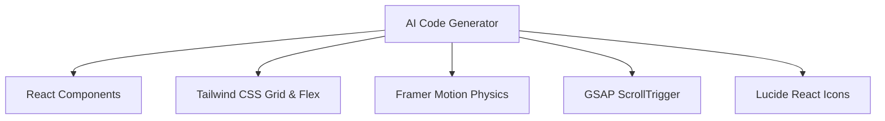

<div align="center">

# ⚡ MotionSites.ai — Premium AI Prompt Library & Design System

### The absolute largest open-source collection of production-ready, hyper-fidelity AI web design prompts.

[](LICENSE)
[](https://github.com/nomaan5541/motionsites-prompt-collection/stargazers)
[](https://github.com/nomaan5541/motionsites-prompt-collection/network/members)
[](https://github.com/nomaan5541/motionsites-prompt-collection/issues)
[](CONTRIBUTING.md)

**166+ free, production-ready AI prompts** that generate stunning landing pages, hero sections, and web components. Copy a prompt → Paste into your AI tool → Get a pixel-perfect design in seconds.

[🌐 **Browse the Live Library**](https://motionsitesai-main.vercel.app/) · [⭐ **Star this repo**](#-support-this-project) · [🤝 **Contribute**](CONTRIBUTING.md) · [📄 **License**](LICENSE)

</div>

---

## 📖 Table of Contents
1. [🚀 Overview & Vision](#-overview--vision)
2. [✨ Key Features & Capabilities](#-key-features--capabilities)
3. [📂 Repository Architecture](#-repository-architecture)
4. [🧑‍💻 Under the Hood: Prompt Engineering Anatomy](#-under-the-hood-prompt-engineering-anatomy)
5. [🖥️ Interactive Gallery Design System](#-interactive-gallery-design-system)
6. [🛠️ Technical Stack Generated](#-technical-stack-generated)
7. [🎯 Step-by-Step AI Generation Playbook](#-step-by-step-ai-generation-playbook)
8. [🎛️ Local CLI Tool Reference](#-local-cli-tool-reference)
9. [📚 Exhaustive Categories Directory](#-exhaustive-categories-directory)
10. [📝 Detailed Prompt Catalog](#-detailed-prompt-catalog)
11. [🤝 Contribution Guidelines & Style Guide](#-contribution-guidelines--style-guide)
12. [⚖️ Legal, Licensing & Fictional Disclaimer](#-legal-licensing--fictional-disclaimer)
13. [🔗 Connection & Community](#-connection--community)

---

## 🚀 Overview & Vision

Modern AI code generation tools (such as **Bolt.new**, **v0.dev**, **GPT-Engineer**, and **Lovable.dev**) are extremely powerful, but they share a common limitation: **they generate standard, generic, and uninspired layouts unless explicitly fed detailed layout instructions.** Without high-fidelity styling specifications, AI models fallback to vanilla Tailwind cards, plain grids, basic system fonts, and generic spacing.

**MotionSites.ai** solves this limitation by acting as a **layout compiler and design system specification layer**. It provides **166+ highly structured design system prompts** written in Markdown, which enforce precise spacing, advanced typography scales, customized color variables, and interactive physics-based animation hooks (Framer Motion and GSAP).

Our mission is to democratize elite frontend design. By translating premium Awwwards-level layouts into structured text instructions, anyone can generate beautiful motion-intensive websites in a single prompt run.

---

## ✨ Key Features & Capabilities

- **166+ Curated Designs**: The library contains templates and component sections covering all major web design trends (Neo-brutalism, Glassmorphism, Space minimalism, Dark Editorial, etc.).
- **Vivid Screenshot Previews**: The live gallery cards dynamically fetch web screenshots via DigitalOcean Spaces CDN, giving you an immediate visual representation of what the prompt produces.
- **Autoplay Hover Previews**: Card visual containers are hooked into a custom mouseover playback manager that starts video loops on hover and immediately pauses them on mouseleave to avoid rendering threads blocking.
- **Physics-Based Card Tilt**: Interactive grid cards feature a responsive 3D card tilt effect calculated dynamically using cursor page coordinates and spring-back transitions.
- **Full Text Prompts in the Repository**: Unlike libraries that only host metadata, every prompt's raw, un-truncated markdown code is stored in the repository.
- **Bonus Premium Prompts Extracted**: Includes 26 premium template configurations extracted from Next.js RSC streams and fully mapped to markdown files.

---

## 📂 Repository Architecture

Here is the folder structure of the MotionSites.ai workspace:

```
motionsites-prompt-collection/
├── .github/                   # GitHub issues templates & workflows
├── assets/                    # Static preview assets
│   ├── images/                # GIF previews
│   └── videos/                # Autoplay webm/mp4 preview video loops
├── bin/                       # Local CLI executable scripts
│   └── index.js               # CLI interface router code
├── demos/                     # Local interactive preview stubs
│   ├── Aethera_Studio/        # Preview stubs for each design name
│   │   └── index.html         # Glassmorphic prompt viewer & copy tool
│   └── ...                    # 159+ additional design folders
├── Pro prompts/               # 66 Premium system prompts
│   └── ...
├── prompts/                   # 100 Free system prompts
│   └── ...
├── index.html                 # Main library interactive interface
├── vercel.json                # Vercel configuration & redirect headers
├── package.json               # Node dependency mappings and CLI bindings
├── README.md                  # Comprehensive documentation
├── LICENSE                    # MIT license agreement
├── DISCLAIMER.md              # Fictional assets notice
└── SECURITY.md                # Responsible vulnerability disclosure
```

---

## 🧑‍💻 Under the Hood: Prompt Engineering Anatomy

Every prompt file inside `prompts/` and `Pro prompts/` is formatted with metadata parameters followed by a heavily structured system instruction sheet.

### Markdown Schema
```markdown
---
title: "Luxury Real Estate"
category: Templates
subCategory: Real-estate
premium: false
imageUrl: https://strvid.nyc3.cdn.digitaloceanspaces.com/motionitems/1780826949672-Luxonn.webp
---

# Luxury Real Estate
```

### The System Prompt Engineering Structure
Our prompts are built around a strict engineering structure to guarantee consistency across different AI models:

1. **Role Definition**: Establishing the persona (e.g. *"Act as an award-winning UI/UX designer and elite React Frontend Developer..."*).
2. **Typography Constraints**: Forcing serif headlines (e.g., `Playfair Display`, `Cormorant Garamond`) combined with clean sans-serif bodies (e.g., `Plus Jakarta Sans`, `Inter`).
3. **HSL Color Tokens**: Forcing consistent custom colors using Tailwind variables (e.g., primary `bg-[#030305]`, glowing gold accent `text-[#d4af37]`).
4. **Spacing & Layouts**: Enforcing wide padding, clean flex/grid headers, overlapping visual sections, and custom borders.
5. **Animation Physics (Framer Motion)**:
   - Defining spring constants: `transition: { type: "spring", stiffness: 100, damping: 20 }`
   - Defining orchestrators: `staggerChildren: 0.1`
6. **GSAP Timelines**: Custom setup guides for ScrollTrigger to pin hero elements and trigger horizontal page translations.

---

## 🖥️ Interactive Gallery Design System

The library's web interface [index.html](file:///f:/motionsites.ai-main/index.html) is built as a dark space-themed gallery using a custom design system:

### 1. The Space Canvas Starfield
An interactive starfield background renders animated, floating star grids combined with glowing blur orbs. The radial gradients rotate slowly across the screen, simulating a nebula.

### 2. 3D Card Hover Tilt Algorithm
Cards react to mouse movements using local coordinates:
```javascript
const rect = card.getBoundingClientRect();
const x = e.clientX - rect.left;
const y = e.clientY - rect.top;
const centerX = rect.width / 2;
const centerY = rect.height / 2;
const rotateX = -(y - centerY) / 15;
const rotateY = (x - centerX) / 15;
card.style.transform = `rotateX(${rotateX}deg) rotateY(${rotateY}deg) translateY(-4px)`;
```
This produces a smooth tilt rotation that tracks the user's cursor.

### 3. Autoplay Hover Previews
Card previews use a combination of lazy-loaded `.webp` screenshot images and dynamic `.mp4`/`.webm` preview loops:
- The preview image covers the card initially.
- On hover, the `preview-video` plays and rises above the screenshot layer.
- On mouseleave, the video immediately pauses to release processor cycles.

---

## 🛠️ Technical Stack Generated

Prompts instruct the generator to output code strictly targeting the following frontend libraries:



- **Framer Motion Constants**:
  - Fade-up: `{ opacity: 0, y: 30 }` to `{ opacity: 1, y: 0 }`
  - Scale spring: `{ scale: 0.95 }` to `{ scale: 1 }`
- **GSAP Scroll Pins**:
  - For sections requiring deep scroll interactions, animations are bound directly to `scrollY` coordinates.

---

## 🎯 Step-by-Step AI Generation Playbook

Follow these steps to generate high-fidelity interfaces using the library:

1. **Select a Design**: Go to the web app gallery and select a template or section that matches your project requirements.
2. **Copy the Prompt**: Click the `Code` button to open the preview modal and copy the text.
3. **Open AI Developer Environment**:
   - **Bolt.new**: Excellent for complete, operational React/Vite development.
   - **v0.dev**: Ideal for visual React component blocks.
   - **GPT-Engineer / Lovable**: Great for database-backed web applications.
4. **Input the Prompt**: Paste the prompt. Add your custom branding instructions if needed (e.g. *"Modify this layout to use blue branding colors instead of gold"*).
5. **Generate & Iterate**: Let the AI compile the design framework, then perform visual modifications as needed.

---

## 🎛️ Local CLI Tool Reference

The CLI utility allows developers to inspect all available prompt names locally from their terminal:

### Installation
```bash
# Link the CLI locally
npm link
```

### Usage Commands
```bash
# List all prompts in both 'prompts/' and 'Pro prompts/'
npx templateprompts list

# Display helper documentation
npx templateprompts help
```

---

## 📚 Exhaustive Categories Directory

We partition our designs into 19 categories representing specific web page layout needs:

- 💻 **SaaS**: High-converting homepages, app dashboards, feature cards, metrics charts, and table views.
- 🎨 **Agency**: High-end typography, horizontal layouts, floating image grids, and creative project cases.
- 👤 **Portfolio**: Designer grids, neon resumes, interactive project timelines, and contact pages.
- 💳 **Fintech**: Sleek tables, dark glass transaction panels, and crypto exchange grids.
- 🌐 **Web3**: Futuristic cyber-themes, NFT galleries, neon borders, and decentralized app states.
- 🛍️ **E-commerce**: Clean digital storefront grids, product detail previews, and minimal carts.
- 🚙 **Automotive**: Dynamic vehicle galleries, full-screen slider folds, and specifications tables.
- 🏔️ **Resort**: Eco-lodge showcases, serene earthy HSL colors, room slider templates, and booking cards.
- 🍽️ **Restaurant**: Premium food menus, dark reservation overlays, and glowing culinary showcases.
- 🎒 **Courses**: Online learning homepages, chapter accordions, and interactive syllabus grids.
- 🛋️ **Interiors**: Interior design slideshows, large architectural grids, and project portfolios.
- 🏛️ **Corporate**: Classic, clean corporate layouts with strict structural headers and grid metrics.
- 🎯 **Hero Sections**: High-fidelity landing folds featuring complex scroll-tied animations.
- 💸 **Pricing Tables**: Grid card systems with neon headers and active option indicators.
- ⚙️ **Features Sections**: Dynamic hover tabs, hover details, and interactive grids.
- 💬 **Testimonial Slider**: Auto-marquee columns and card carousels.
- 📑 **Footers**: Creative custom footer menus and social grids.
- ❓ **FAQ Accordions**: Expandable card components utilizing clean spring motion.

---

## 📝 Detailed Prompt Catalog

Below is a highlight of key prompts contained in the library:

### 1. templates/Kintaro.md
- **Title**: Kintaro Restaurant Website
- **Category**: Restaurant / Templates
- **Style**: Dark luxury, gold accents (`#d4af37`), high contrast serif text, full-screen vertical menu overlays, smooth Lenis scrolling.

### 2. prompts/Zedian.md
- **Title**: Zedian Creative Portfolio
- **Category**: Portfolio / Templates
- **Style**: Cyber-minimalism, neon green variables (`#00ff66`), pixelated borders, hover terminal logs, terminal shell interface commands.

### 3. prompts/Car_Shine.md
- **Title**: Car Shine Detailing Landing Page
- **Category**: Auto / Templates
- **Style**: Deep neon blue glassmorphism cards, wet-effect gradients, vehicle pricing sliders, interactive before/after image sliders.

### 4. prompts/Naturally.md
- **Title**: Naturally Skincare Store
- **Category**: E-commerce / Templates
- **Style**: Serene minimal layout, soft sage green theme (`#8fbc8f`), large botanical background images, clean grid tables.

### 5. prompts/Infine.md
- **Title**: Infine Digital Agency
- **Category**: Agency / Templates
- **Style**: Brutalist design, oversized font scales, infinite marquee tracks, raw container grids.

---

## 🤝 Contribution Guidelines & Style Guide

We love prompt contributions! If you have optimized a system prompt for v0 or Bolt.new, help expand this collection:

### File Format Guidelines
Ensure new prompts have correct frontmatter configurations:
```yaml
---
title: "My Design Name"
category: "Templates or Sections"
subCategory: "SaaS, Hero, Pricing, etc."
premium: false
imageUrl: "DigitalOcean Spaces screenshot URL"
---
```

### Writing the Prompt Text
- Enclose the prompt body inside a ` ```text ` markdown block.
- Keep instructions highly detailed. Avoid generic terms; specify layout alignments, color palettes, and motion attributes.

---

## ⚖️ Legal Disclaimer

- **Trademark & Brands**: All company names, logos, brand specifications, and UI layouts featured in these prompts are entirely fictional. Any resemblance to real brands is coincidental.
- **Licensing**: All code and prompts are distributed under the [MIT License](LICENSE). You are free to modify, integrate, sell, or distribute the generated designs for personal or commercial projects.

---

## 🔗 Connect

- **Live Website**: [motionsitesai-main.vercel.app](https://motionsitesai-main.vercel.app/)
- **GitHub profile**: [@nomaan5541](https://github.com/nomaan5541)
- **Instagram Direct**: [@Virus_boss](https://instagram.com/Virus_boss)

---

<div align="center">

### Designed and Built by [Nomaan Khan](https://github.com/nomaan5541)

If you find this repository useful, please consider giving it a ⭐ star!

</div>
