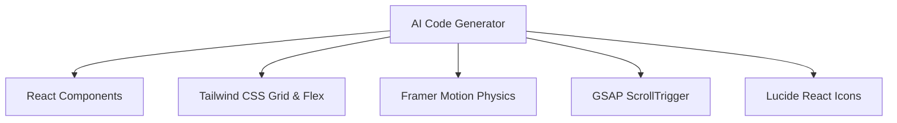

<div align="center">

# ⚡ MotionSites Prompts Collection

### The absolute largest open-source collection of production-ready, hyper-fidelity AI web design prompts — **661 prompts and growing.**

[](LICENSE)
[](https://github.com/nomaan5541/motionsites-prompt-collection/stargazers)
[](https://github.com/nomaan5541/motionsites-prompt-collection/network/members)
[](https://github.com/nomaan5541/motionsites-prompt-collection/issues)
[](CONTRIBUTING.md)

**661 free, production-ready AI prompts** that generate stunning landing pages, hero sections, and web components. Copy a prompt → Paste into your AI tool → Get a pixel-perfect design in seconds.

[🌐 **Browse the Live Library**](https://motionsitesai-main.vercel.app/) · [⭐ **Star this repo**](#-support-this-project) · [🤝 **Contribute**](CONTRIBUTING.md) · [📄 **License**](LICENSE)

</div>

---

## 💥 Recent Major Updates & Today's Changelog

> **Latest Release Summary**: Massive library expansion (+191 Prompts), 6 live interactive component demos, 3 new dedicated site sections, and user notice systems.

### 🌟 1. Extracted 191 New Prompts & Asset Packages
* 🟢 **HorizonX Library (93 Prompts)**: Extracted senior-grade React, WebGL particle, & liquid hero prompts (*Morpho 3D Particle Butterfly*, *Aurel Liquid Hero*, *Hand Prosthesis Simulator*, *Digital Wave Field Hero*, *EIDOLON Monolith Hero*, *Gallery Ring 3D*, etc.). Saved in [`extractions/horizonx`](file:///f:/motionsites.ai-main/extractions/horizonx).
* 🟢 **21st.dev Registry (93 Prompts)**: Extracted community component & template prompts across 75 categories (*Animated Heroes*, *Shaders*, *Backgrounds*, *Gradients*, *Buttons*, *Footers*, *AI Chats*) with `npx shadcn@latest add ...` CLI installation commands. Saved in [`extractions/21st_dev`](file:///f:/motionsites.ai-main/extractions/21st_dev).
* 🟢 **Superdesign Canvas (5 Prompts)**: Extracted AI product design agent prompts (*Infinite Canvas Motion*, *Glassmorphism UI Component Suite*, *AI Prompt-to-Mockup Engine*, *SaaS Hero Showcase*, *Theme Switcher Engine*). Saved in [`extractions/superdesign`](file:///f:/motionsites.ai-main/extractions/superdesign).

### 💻 2. Built 6 Live Interactive Component Demos (`/examples`)
Created 6 full, interactive, high-end React component demos accessible at `/examples`:
1. **MORPHO — 3D Particles Simulator**: HTML5 Canvas particle butterfly with real-time cursor physics, wing-flap animation, particle count slider (60–300), speed multiplier, and color scheme picker (*Blue*, *Purple*, *Gold*).
2. **Aurel Liquid Hero**: Dark glass hero section with water ripple gradient blur, editorial serif typography, ambient equalizer frequency visualizer, and sound toggle.
3. **Superdesign Infinite Canvas Motion**: Interactive canvas with draggable node cards, animated SVG flow lines, zoom/pan controls (`+` / `-`), and AI Node creation.
4. **Superdesign Glassmorphism UI Suite**: Backdrop-blur card container with 1px neon borders, prompt input bar, live UI mockup vs. TSX code tab switcher, and **Dark / Light theme switcher**.
5. **21st.dev Red In Black Neon Shader**: High-intensity dark mode hero section with crimson pulsing neon WebGL shader glow, author metadata (`ashish.indora`), and copyable `npx shadcn` CLI command bar.
6. **21st.dev AI Agent Pipeline & Terminal**: Autonomous AI code build pipeline card (`Input Spec` ➔ `Code Generator` ➔ `AST Linter` ➔ `Deploy Sandbox`) with an interactive **"Run AI Pipeline"** button and live terminal stream.

### 🎨 3. Added 3 Dedicated Website Sections
* Dedicated Homepage visual sections for **HorizonX Library**, **21st.dev Registry**, and **Superdesign Canvas**.
* Interactive category filter chips added to the Search page (`/search`) to filter by site source in 1-click.

### 📢 4. Added Notice Modal Popup & Bottom Banner
* **Notice Popup Modal**: Auto-opens on first visit informing users of prompt availability and search capabilities.
* **Persistent Bottom Banner**: Sticky footer banner with search quick-links.

---

## 📖 Table of Contents
1. [🚀 Overview & Vision](#-overview--vision)
2. [✨ Key Features & Capabilities](#-key-features--capabilities)
3. [📂 Repository Architecture](#-repository-architecture)
4. [🧑‍💻 Under the Hood: Prompt Engineering Anatomy](#-under-the-hood-prompt-engineering-anatomy)
5. [🖥️ Interactive Gallery Design System](#-interactive-gallery-design-system)
6. [🛠️ Technical Stack Generated](#-technical-stack-generated)
7. [🎯 Step-by-Step AI Generation Playbook](#-step-by-step-ai-generation-playbook)
8. [🎛️ Local CLI Tool Reference](#-local-cli-tool-reference)
9. [📚 Exhaustive Categories Directory](#-exhaustive-categories-directory)
10. [📝 Detailed Prompt Catalog](#-detailed-prompt-catalog)
11. [🤝 Contribution Guidelines & Style Guide](#-contribution-guidelines--style-guide)
12. [⚖️ Legal, Licensing & Fictional Disclaimer](#-legal-licensing--fictional-disclaimer)
13. [🔗 Connection & Community](#-connection--community)

---

## 🚀 Overview & Vision

Modern AI code generation tools (such as **Bolt.new**, **v0.dev**, **GPT-Engineer**, and **Lovable.dev**) are extremely powerful, but they share a common limitation: **they generate standard, generic, and uninspired layouts unless explicitly fed detailed layout instructions.** Without high-fidelity styling specifications, AI models fallback to vanilla Tailwind cards, plain grids, basic system fonts, and generic spacing.

**MotionSites Prompts Collection** solves this limitation by acting as a **layout compiler and design system specification layer**. It provides **339 highly structured design system prompts** written in Markdown, which enforce precise spacing, advanced typography scales, customized color variables, and interactive physics-based animation hooks (Framer Motion and GSAP).

Our mission is to democratize elite frontend design. By translating premium Awwwards-level layouts into structured text instructions, anyone can generate beautiful motion-intensive websites in a single prompt run.

---

## ✨ Key Features & Capabilities

- **339 Curated Designs**: The library contains templates and component sections covering all major web design trends (Neo-brutalism, Glassmorphism, Space minimalism, Dark Editorial, etc.).
- **Vivid Screenshot Previews**: The live gallery cards dynamically fetch web screenshots via DigitalOcean Spaces CDN, giving you an immediate visual representation of what the prompt produces.
- **Autoplay Hover Previews**: Card visual containers are hooked into a custom mouseover playback manager that starts video loops on hover and immediately pauses them on mouseleave to avoid rendering threads blocking.
- **Physics-Based Card Tilt**: Interactive grid cards feature a responsive 3D card tilt effect calculated dynamically using cursor page coordinates and spring-back transitions.
- **Full Text Prompts in the Repository**: Unlike libraries that only host metadata, every prompt's raw, un-truncated markdown code is stored in the repository.
- **Bonus Premium Prompts Extracted**: Includes 66 premium template configurations extracted and fully mapped to markdown files.
- **Community-Sourced Collection**: Incorporates 113 additional prompts sourced from the open-source community, expanding the library to 339 total prompts.

---

## 📂 Repository Architecture

Here is the folder structure of the MotionSites Prompts Collection workspace:

```text
motionsites-prompt-collection/
├── .github/                   # GitHub issues templates & workflows
├── assets/                    # Static preview assets (images and videos)
├── bin/                       # Local CLI executable scripts
├── demos/                     # Local interactive preview stubs
├── Pro prompts/               # Premium system prompts
├── prompts/                   # Free system prompts
├── scripts/                   # Utility scripts for downloading and mapping assets
├── index.html                 # Main library interactive interface
├── vercel.json                # Vercel configuration & redirect headers
├── package.json               # Node dependency mappings and CLI bindings
├── README.md                  # Comprehensive documentation
├── CODE_OF_CONDUCT.md         # Community guidelines
├── CONTRIBUTING.md            # Guidelines for contributing to the repository
├── LICENSE                    # MIT license agreement
├── DISCLAIMER.md              # Fictional assets notice
├── DMCA.md                    # DMCA policy and procedures
└── SECURITY.md                # Responsible vulnerability disclosure
```

---

## 🧑‍💻 Under the Hood: Prompt Engineering Anatomy

Every prompt file inside `prompts/` and `Pro prompts/` is formatted with metadata parameters followed by a heavily structured system instruction sheet.

### Markdown Schema
```markdown
---
title: "Luxury Real Estate"
category: Templates
subCategory: Real-estate
premium: false
imageUrl: https://strvid.nyc3.cdn.digitaloceanspaces.com/motionitems/1780826949672-Luxonn.webp
---

# Luxury Real Estate
```

### The System Prompt Engineering Structure
Our prompts are built around a strict engineering structure to guarantee consistency across different AI models:

1. **Role Definition**: Establishing the persona (e.g. *"Act as an award-winning UI/UX designer and elite React Frontend Developer..."*).
2. **Typography Constraints**: Forcing serif headlines (e.g., `Playfair Display`, `Cormorant Garamond`) combined with clean sans-serif bodies (e.g., `Plus Jakarta Sans`, `Inter`).
3. **HSL Color Tokens**: Forcing consistent custom colors using Tailwind variables (e.g., primary `bg-[#030305]`, glowing gold accent `text-[#d4af37]`).
4. **Spacing & Layouts**: Enforcing wide padding, clean flex/grid headers, overlapping visual sections, and custom borders.
5. **Animation Physics (Framer Motion)**:
   - Defining spring constants: `transition: { type: "spring", stiffness: 100, damping: 20 }`
   - Defining orchestrators: `staggerChildren: 0.1`
6. **GSAP Timelines**: Custom setup guides for ScrollTrigger to pin hero elements and trigger horizontal page translations.

---

## 🖥️ Interactive Gallery Design System

The library's web interface [index.html](index.html) is built as a dark space-themed gallery using a custom design system:

### 1. The Space Canvas Starfield
An interactive starfield background renders animated, floating star grids combined with glowing blur orbs. The radial gradients rotate slowly across the screen, simulating a nebula.

### 2. 3D Card Hover Tilt Algorithm
Cards react to mouse movements using local coordinates:
```javascript
const rect = card.getBoundingClientRect();
const x = e.clientX - rect.left;
const y = e.clientY - rect.top;
const centerX = rect.width / 2;
const centerY = rect.height / 2;
const rotateX = -(y - centerY) / 15;
const rotateY = (x - centerX) / 15;
card.style.transform = `rotateX(${rotateX}deg) rotateY(${rotateY}deg) translateY(-4px)`;
```
This produces a smooth tilt rotation that tracks the user's cursor.

### 3. Autoplay Hover Previews
Card previews use a combination of lazy-loaded `.webp` screenshot images and dynamic `.mp4`/`.webm` preview loops:
- The preview image covers the card initially.
- On hover, the `preview-video` plays and rises above the screenshot layer.
- On mouseleave, the video immediately pauses to release processor cycles.

---

## 🛠️ Technical Stack Generated

Prompts instruct the generator to output code strictly targeting the following frontend libraries:



- **Framer Motion Constants**:
  - Fade-up: `{ opacity: 0, y: 30 }` to `{ opacity: 1, y: 0 }`
  - Scale spring: `{ scale: 0.95 }` to `{ scale: 1 }`
- **GSAP Scroll Pins**:
  - For sections requiring deep scroll interactions, animations are bound directly to `scrollY` coordinates.

---

## 🎯 Step-by-Step AI Generation Playbook

Follow these steps to generate high-fidelity interfaces using the library:

1. **Select a Design**: Go to the web app gallery and select a template or section that matches your project requirements.
2. **Copy the Prompt**: Click the `Code` button to open the preview modal and copy the text.
3. **Open AI Developer Environment**:
   - **Bolt.new**: Excellent for complete, operational React/Vite development.
   - **v0.dev**: Ideal for visual React component blocks.
   - **GPT-Engineer / Lovable**: Great for database-backed web applications.
4. **Input the Prompt**: Paste the prompt. Add your custom branding instructions if needed (e.g. *"Modify this layout to use blue branding colors instead of gold"*).
5. **Generate & Iterate**: Let the AI compile the design framework, then perform visual modifications as needed.

---

## 🎛️ Local CLI Tool Reference

The CLI utility allows developers to inspect all available prompt names locally from their terminal:

### Installation
```bash
# Link the CLI locally
npm link
```

### Usage Commands
```bash
# List all prompts in both 'prompts/' and 'Pro prompts/'
npx templateprompts list

# Display helper documentation
npx templateprompts help
```

---

## 📚 Exhaustive Categories Directory

We partition our designs into 19 categories representing specific web page layout needs:

- 💻 **SaaS**: High-converting homepages, app dashboards, feature cards, metrics charts, and table views.
- 🎨 **Agency**: High-end typography, horizontal layouts, floating image grids, and creative project cases.
- 👤 **Portfolio**: Designer grids, neon resumes, interactive project timelines, and contact pages.
- 💳 **Fintech**: Sleek tables, dark glass transaction panels, and crypto exchange grids.
- 🌐 **Web3**: Futuristic cyber-themes, NFT galleries, neon borders, and decentralized app states.
- 🛍️ **E-commerce**: Clean digital storefront grids, product detail previews, and minimal carts.
- 🚙 **Automotive**: Dynamic vehicle galleries, full-screen slider folds, and specifications tables.
- 🏔️ **Resort**: Eco-lodge showcases, serene earthy HSL colors, room slider templates, and booking cards.
- 🍽️ **Restaurant**: Premium food menus, dark reservation overlays, and glowing culinary showcases.
- 🎒 **Courses**: Online learning homepages, chapter accordions, and interactive syllabus grids.
- 🛋️ **Interiors**: Interior design slideshows, large architectural grids, and project portfolios.
- 🏛️ **Corporate**: Classic, clean corporate layouts with strict structural headers and grid metrics.
- 🎯 **Hero Sections**: High-fidelity landing folds featuring complex scroll-tied animations.
- 💸 **Pricing Tables**: Grid card systems with neon headers and active option indicators.
- ⚙️ **Features Sections**: Dynamic hover tabs, hover details, and interactive grids.
- 💬 **Testimonial Slider**: Auto-marquee columns and card carousels.
- 📑 **Footers**: Creative custom footer menus and social grids.
- ❓ **FAQ Accordions**: Expandable card components utilizing clean spring motion.

---

## 📝 Complete Prompt Catalog (470 Prompts)

Below is the full list of every prompt in the library.

### 📁 `prompts/` — 470 Prompts

| # | Prompt Name | File |
|---|---|---|
| 1 | 2 | [`prompts/2.md`](prompts/2.md) |
| 2 | 3 | [`prompts/3.md`](prompts/3.md) |
| 3 | 3d Animation Hero | [`prompts/3d_Animation_Hero.md`](prompts/3d_Animation_Hero.md) |
| 4 | 3D Collectible Hero | [`prompts/3D_Collectible_Hero.md`](prompts/3D_Collectible_Hero.md) |
| 5 | 3D Jack Portfolio | [`prompts/3D_Jack_Portfolio.md`](prompts/3D_Jack_Portfolio.md) |
| 6 | 3d story | [`prompts/3d-story.md`](prompts/3d-story.md) |
| 7 | 3d studio pricing | [`prompts/3d-studio-pricing.md`](prompts/3d-studio-pricing.md) |
| 8 | 4 | [`prompts/4.md`](prompts/4.md) |
| 9 | 5 | [`prompts/5.md`](prompts/5.md) |
| 10 | 8 | [`prompts/8.md`](prompts/8.md) |
| 11 | 12 | [`prompts/12.md`](prompts/12.md) |
| 12 | 404 planet | [`prompts/404-planet.md`](prompts/404-planet.md) |
| 13 | Acreage Farming | [`prompts/Acreage_Farming.md`](prompts/Acreage_Farming.md) |
| 14 | acreage farming hero | [`prompts/acreage-farming-hero.md`](prompts/acreage-farming-hero.md) |
| 15 | Adeora Hero | [`prompts/Adeora_Hero.md`](prompts/Adeora_Hero.md) |
| 16 | aerocore | [`prompts/aerocore.md`](prompts/aerocore.md) |
| 17 | Aethera Studio | [`prompts/Aethera_Studio.md`](prompts/Aethera_Studio.md) |
| 18 | Aetheris Voyage | [`prompts/Aetheris_Voyage.md`](prompts/Aetheris_Voyage.md) |
| 19 | agency services | [`prompts/agency-services.md`](prompts/agency-services.md) |
| 20 | Agentify Hero | [`prompts/Agentify_Hero.md`](prompts/Agentify_Hero.md) |
| 21 | AI Automation Hero | [`prompts/AI Automation Hero.md`](prompts/AI%20Automation%20Hero.md) |
| 22 | AI Automation | [`prompts/AI_Automation.md`](prompts/AI_Automation.md) |
| 23 | AI Designer Portfolio | [`prompts/AI_Designer_Portfolio.md`](prompts/AI_Designer_Portfolio.md) |
| 24 | AI Image Generator UI | [`prompts/AI_Image_Generator_UI.md`](prompts/AI_Image_Generator_UI.md) |
| 25 | AI Workflow Hero | [`prompts/AI_Workflow_Hero.md`](prompts/AI_Workflow_Hero.md) |
| 26 | ai designer agency | [`prompts/ai-designer-agency.md`](prompts/ai-designer-agency.md) |
| 27 | ai driving assistant | [`prompts/ai-driving-assistant.md`](prompts/ai-driving-assistant.md) |
| 28 | ai interface | [`prompts/ai-interface.md`](prompts/ai-interface.md) |
| 29 | ai meeting notes | [`prompts/ai-meeting-notes.md`](prompts/ai-meeting-notes.md) |
| 30 | AKOR Security | [`prompts/AKOR_Security.md`](prompts/AKOR_Security.md) |
| 31 | akor security landing | [`prompts/akor-security-landing.md`](prompts/akor-security-landing.md) |
| 32 | Alto Hero | [`prompts/Alto_Hero.md`](prompts/Alto_Hero.md) |
| 33 | animated cards | [`prompts/animated-cards.md`](prompts/animated-cards.md) |
| 34 | Apex SaaS | [`prompts/Apex_SaaS.md`](prompts/Apex_SaaS.md) |
| 35 | apex program accordion | [`prompts/apex-program-accordion.md`](prompts/apex-program-accordion.md) |
| 36 | apex pulse | [`prompts/apex-pulse.md`](prompts/apex-pulse.md) |
| 37 | apex saas hero | [`prompts/apex-saas-hero.md`](prompts/apex-saas-hero.md) |
| 38 | arceage contact us | [`prompts/arceage-contact-us.md`](prompts/arceage-contact-us.md) |
| 39 | arceage services | [`prompts/arceage-services.md`](prompts/arceage-services.md) |
| 40 | arceage stats | [`prompts/arceage-stats.md`](prompts/arceage-stats.md) |
| 41 | arceage testimonial | [`prompts/arceage-testimonial.md`](prompts/arceage-testimonial.md) |
| 42 | Arise | [`prompts/Arise.md`](prompts/Arise.md) |
| 43 | Art Landing | [`prompts/Art_Landing.md`](prompts/Art_Landing.md) |
| 44 | Ashley | [`prompts/Ashley.md`](prompts/Ashley.md) |
| 45 | Asme | [`prompts/Asme.md`](prompts/Asme.md) |
| 46 | Assist Hero | [`prompts/Assist_Hero.md`](prompts/Assist_Hero.md) |
| 47 | audio showcase | [`prompts/audio-showcase.md`](prompts/audio-showcase.md) |
| 48 | Aura Hero | [`prompts/Aura_Hero.md`](prompts/Aura_Hero.md) |
| 49 | AuraMail | [`prompts/AuraMail.md`](prompts/AuraMail.md) |
| 50 | Aurora Onboard | [`prompts/Aurora_Onboard.md`](prompts/Aurora_Onboard.md) |
| 51 | Automation Machines | [`prompts/Automation_Machines.md`](prompts/Automation_Machines.md) |
| 52 | automation machines hero | [`prompts/automation-machines-hero.md`](prompts/automation-machines-hero.md) |
| 53 | axion about | [`prompts/axion-about.md`](prompts/axion-about.md) |
| 54 | Bali | [`prompts/Bali.md`](prompts/Bali.md) |
| 55 | Basilico Restaurant | [`prompts/Basilico_Restaurant.md`](prompts/Basilico_Restaurant.md) |
| 56 | beauty categories | [`prompts/beauty-categories.md`](prompts/beauty-categories.md) |
| 57 | beauty products | [`prompts/beauty-products.md`](prompts/beauty-products.md) |
| 58 | Benefits Features | [`prompts/Benefits_Features.md`](prompts/Benefits_Features.md) |
| 59 | bento grid stats | [`prompts/bento-grid-stats.md`](prompts/bento-grid-stats.md) |
| 60 | bio active | [`prompts/bio-active.md`](prompts/bio-active.md) |
| 61 | bio age dashboard | [`prompts/bio-age-dashboard.md`](prompts/bio-age-dashboard.md) |
| 62 | bio digital | [`prompts/bio-digital.md`](prompts/bio-digital.md) |
| 63 | Bionova Biotech | [`prompts/Bionova_Biotech.md`](prompts/Bionova_Biotech.md) |
| 64 | bionova hero | [`prompts/bionova-hero.md`](prompts/bionova-hero.md) |
| 65 | bl | [`prompts/bl.md`](prompts/bl.md) |
| 66 | Blog Showcase | [`prompts/Blog_Showcase.md`](prompts/Blog_Showcase.md) |
| 67 | Bloom AI | [`prompts/Bloom_AI.md`](prompts/Bloom_AI.md) |
| 68 | Bloomora Hero | [`prompts/Bloomora_Hero.md`](prompts/Bloomora_Hero.md) |
| 69 | Bold Portfolio Hero | [`prompts/Bold Portfolio Hero.md`](prompts/Bold%20Portfolio%20Hero.md) |
| 70 | bold studio | [`prompts/bold-studio.md`](prompts/bold-studio.md) |
| 71 | Book Hero | [`prompts/Book_Hero.md`](prompts/Book_Hero.md) |
| 72 | BookedUp | [`prompts/BookedUp.md`](prompts/BookedUp.md) |
| 73 | botanical shadow about | [`prompts/botanical-shadow-about.md`](prompts/botanical-shadow-about.md) |
| 74 | build with us | [`prompts/build-with-us.md`](prompts/build-with-us.md) |
| 75 | Buzzentic Agency | [`prompts/Buzzentic Agency.md`](prompts/Buzzentic%20Agency.md) |
| 76 | Callisto Hero | [`prompts/Callisto_Hero.md`](prompts/Callisto_Hero.md) |
| 77 | Calm Hero | [`prompts/Calm_Hero.md`](prompts/Calm_Hero.md) |
| 78 | Car Shine | [`prompts/Car_Shine.md`](prompts/Car_Shine.md) |
| 79 | cargo group | [`prompts/cargo-group.md`](prompts/cargo-group.md) |
| 80 | cargox mobile | [`prompts/cargox-mobile.md`](prompts/cargox-mobile.md) |
| 81 | Celestia | [`prompts/Celestia.md`](prompts/Celestia.md) |
| 82 | celestial renewal | [`prompts/celestial-renewal.md`](prompts/celestial-renewal.md) |
| 83 | Cinematic Landing Page | [`prompts/Cinematic_Landing_Page.md`](prompts/Cinematic_Landing_Page.md) |
| 84 | cinematic brand | [`prompts/cinematic-brand.md`](prompts/cinematic-brand.md) |
| 85 | cleantech | [`prompts/cleantech.md`](prompts/cleantech.md) |
| 86 | ClearInvoice SaaS Hero | [`prompts/ClearInvoice SaaS Hero.md`](prompts/ClearInvoice%20SaaS%20Hero.md) |
| 87 | ClearInvoice SaaS Hero1 | [`prompts/ClearInvoice SaaS Hero1.md`](prompts/ClearInvoice%20SaaS%20Hero1.md) |
| 88 | ClubX Investors | [`prompts/ClubX_Investors.md`](prompts/ClubX_Investors.md) |
| 89 | clubx hero | [`prompts/clubx-hero.md`](prompts/clubx-hero.md) |
| 90 | CodeNest Coding Platform | [`prompts/CodeNest_Coding_Platform.md`](prompts/CodeNest_Coding_Platform.md) |
| 91 | codercrest hero | [`prompts/codercrest-hero.md`](prompts/codercrest-hero.md) |
| 92 | CoderCrest | [`prompts/CoderCrest.md`](prompts/CoderCrest.md) |
| 93 | CodeYoung | [`prompts/CodeYoung.md`](prompts/CodeYoung.md) |
| 94 | coffee rewards | [`prompts/coffee-rewards.md`](prompts/coffee-rewards.md) |
| 95 | cognitra feature | [`prompts/cognitra-feature.md`](prompts/cognitra-feature.md) |
| 96 | cognitra offer | [`prompts/cognitra-offer.md`](prompts/cognitra-offer.md) |
| 97 | Coinwise Hero | [`prompts/Coinwise_Hero.md`](prompts/Coinwise_Hero.md) |
| 98 | Community CTA | [`prompts/Community_CTA.md`](prompts/Community_CTA.md) |
| 99 | contact cybernetic | [`prompts/contact-cybernetic.md`](prompts/contact-cybernetic.md) |
| 100 | conversion | [`prompts/conversion.md`](prompts/conversion.md) |
| 101 | cosmic | [`prompts/cosmic.md`](prompts/cosmic.md) |
| 102 | cosmos interface | [`prompts/cosmos-interface.md`](prompts/cosmos-interface.md) |
| 103 | cozypaws | [`prompts/cozypaws.md`](prompts/cozypaws.md) |
| 104 | Creative Agency | [`prompts/Creative_Agency.md`](prompts/Creative_Agency.md) |
| 105 | Creative Studio | [`prompts/Creative_Studio.md`](prompts/Creative_Studio.md) |
| 106 | creative portfolio | [`prompts/creative-portfolio.md`](prompts/creative-portfolio.md) |
| 107 | cross border | [`prompts/cross-border.md`](prompts/cross-border.md) |
| 108 | Crush | [`prompts/Crush.md`](prompts/Crush.md) |
| 109 | Crypto Wealth | [`prompts/Crypto_Wealth.md`](prompts/Crypto_Wealth.md) |
| 110 | crypto wealth hero | [`prompts/crypto-wealth-hero.md`](prompts/crypto-wealth-hero.md) |
| 111 | Cryptoniq Hero | [`prompts/Cryptoniq_Hero.md`](prompts/Cryptoniq_Hero.md) |
| 112 | Cursor Follow | [`prompts/Cursor_Follow.md`](prompts/Cursor_Follow.md) |
| 113 | cyberpunk reveal | [`prompts/cyberpunk-reveal.md`](prompts/cyberpunk-reveal.md) |
| 114 | Cybersecurity Hero v2 | [`prompts/Cybersecurity_Hero_v2.md`](prompts/Cybersecurity_Hero_v2.md) |
| 115 | Cybersecurity Hero | [`prompts/Cybersecurity_Hero.md`](prompts/Cybersecurity_Hero.md) |
| 116 | Daisy Shop | [`prompts/Daisy_Shop.md`](prompts/Daisy_Shop.md) |
| 117 | daisy sweet | [`prompts/daisy-sweet.md`](prompts/daisy-sweet.md) |
| 118 | daisy wild | [`prompts/daisy-wild.md`](prompts/daisy-wild.md) |
| 119 | Dark Portfolio Hero | [`prompts/Dark Portfolio Hero.md`](prompts/Dark%20Portfolio%20Hero.md) |
| 120 | Dashboard UI | [`prompts/Dashboard_UI.md`](prompts/Dashboard_UI.md) |
| 121 | Datacore SaaS Hero | [`prompts/Datacore SaaS Hero.md`](prompts/Datacore%20SaaS%20Hero.md) |
| 122 | Datacore Booking | [`prompts/Datacore_Booking.md`](prompts/Datacore_Booking.md) |
| 123 | deck investor | [`prompts/deck-investor.md`](prompts/deck-investor.md) |
| 124 | DeepDive Hero | [`prompts/DeepDive_Hero.md`](prompts/DeepDive_Hero.md) |
| 125 | DesignPro Academy | [`prompts/DesignPro_Academy.md`](prompts/DesignPro_Academy.md) |
| 126 | Digistudio | [`prompts/Digistudio.md`](prompts/Digistudio.md) |
| 127 | Digital Epoch | [`prompts/Digital_Epoch.md`](prompts/Digital_Epoch.md) |
| 128 | Digital Reality | [`prompts/Digital_Reality.md`](prompts/Digital_Reality.md) |
| 129 | digital experiences | [`prompts/digital-experiences.md`](prompts/digital-experiences.md) |
| 130 | Digitwist AI Builder | [`prompts/Digitwist_AI_Builder.md`](prompts/Digitwist_AI_Builder.md) |
| 131 | Dot | [`prompts/Dot.md`](prompts/Dot.md) |
| 132 | Dreamcore Landing | [`prompts/Dreamcore_Landing.md`](prompts/Dreamcore_Landing.md) |
| 133 | Duolingo Styleguide | [`prompts/Duolingo_Styleguide.md`](prompts/Duolingo_Styleguide.md) |
| 134 | E commerce Website | [`prompts/E_commerce_Website.md`](prompts/E_commerce_Website.md) |
| 135 | E commerce Website | [`prompts/E-commerce_Website.md`](prompts/E-commerce_Website.md) |
| 136 | Eathan Portfolio | [`prompts/Eathan_Portfolio.md`](prompts/Eathan_Portfolio.md) |
| 137 | eco intelligence | [`prompts/eco-intelligence.md`](prompts/eco-intelligence.md) |
| 138 | ecommerce website landing | [`prompts/ecommerce-website-landing.md`](prompts/ecommerce-website-landing.md) |
| 139 | EcoNexa | [`prompts/EcoNexa.md`](prompts/EcoNexa.md) |
| 140 | EcoVolta V2 | [`prompts/EcoVolta_V2.md`](prompts/EcoVolta_V2.md) |
| 141 | ecovolta hero | [`prompts/ecovolta-hero.md`](prompts/ecovolta-hero.md) |
| 142 | ecovolta v2 hero | [`prompts/ecovolta-v2-hero.md`](prompts/ecovolta-v2-hero.md) |
| 143 | EcoVolta | [`prompts/EcoVolta.md`](prompts/EcoVolta.md) |
| 144 | editorial collection cta | [`prompts/editorial-collection-cta.md`](prompts/editorial-collection-cta.md) |
| 145 | Elevate | [`prompts/Elevate.md`](prompts/Elevate.md) |
| 146 | Élysian Hero | [`prompts/Élysian_Hero.md`](prompts/%C3%89lysian_Hero.md) |
| 147 | Email Landing Page | [`prompts/Email_Landing_Page.md`](prompts/Email_Landing_Page.md) |
| 148 | Email Marketing | [`prompts/Email_Marketing.md`](prompts/Email_Marketing.md) |
| 149 | ember dsgn hero | [`prompts/ember-dsgn-hero.md`](prompts/ember-dsgn-hero.md) |
| 150 | EMBERdsgn | [`prompts/EMBERdsgn.md`](prompts/EMBERdsgn.md) |
| 151 | Equilibrium | [`prompts/Equilibrium.md`](prompts/Equilibrium.md) |
| 152 | Evergreen Finance | [`prompts/Evergreen_Finance.md`](prompts/Evergreen_Finance.md) |
| 153 | EVR Ventures | [`prompts/EVR_Ventures.md`](prompts/EVR_Ventures.md) |
| 154 | evr ventures hero | [`prompts/evr-ventures-hero.md`](prompts/evr-ventures-hero.md) |
| 155 | EvvyDigital | [`prompts/EvvyDigital.md`](prompts/EvvyDigital.md) |
| 156 | FAQ   Insights | [`prompts/FAQ_-_Insights.md`](prompts/FAQ_-_Insights.md) |
| 157 | FAQ – Dark Accordion | [`prompts/FAQ_–_Dark_Accordion.md`](prompts/FAQ_%E2%80%93_Dark_Accordion.md) |
| 158 | FAQ CTA | [`prompts/FAQ_CTA.md`](prompts/FAQ_CTA.md) |
| 159 | Features   Analytics | [`prompts/Features_-_Analytics.md`](prompts/Features_-_Analytics.md) |
| 160 | Features   Flow | [`prompts/Features_-_Flow.md`](prompts/Features_-_Flow.md) |
| 161 | Features   Kinetic | [`prompts/Features_-_Kinetic.md`](prompts/Features_-_Kinetic.md) |
| 162 | Features   Vision | [`prompts/Features_-_Vision.md`](prompts/Features_-_Vision.md) |
| 163 | features | [`prompts/features.md`](prompts/features.md) |
| 164 | feedback slider | [`prompts/feedback-slider.md`](prompts/feedback-slider.md) |
| 165 | financial suite | [`prompts/financial-suite.md`](prompts/financial-suite.md) |
| 166 | financialfocus | [`prompts/financialfocus.md`](prompts/financialfocus.md) |
| 167 | finflow | [`prompts/finflow.md`](prompts/finflow.md) |
| 168 | Finlytic AI Agent | [`prompts/Finlytic_AI_Agent.md`](prompts/Finlytic_AI_Agent.md) |
| 169 | finlytic hero | [`prompts/finlytic-hero.md`](prompts/finlytic-hero.md) |
| 170 | flowmate carousal | [`prompts/flowmate-carousal.md`](prompts/flowmate-carousal.md) |
| 171 | flowmate landing | [`prompts/flowmate-landing.md`](prompts/flowmate-landing.md) |
| 172 | FlowMate | [`prompts/FlowMate.md`](prompts/FlowMate.md) |
| 173 | Focus AI | [`prompts/Focus_AI.md`](prompts/Focus_AI.md) |
| 174 | focus ai landing | [`prompts/focus-ai-landing.md`](prompts/focus-ai-landing.md) |
| 175 | Footer   Elevated | [`prompts/Footer_-_Elevated.md`](prompts/Footer_-_Elevated.md) |
| 176 | Footer   Nexus Parallax | [`prompts/Footer_-_Nexus_Parallax.md`](prompts/Footer_-_Nexus_Parallax.md) |
| 177 | Footer   Orbit | [`prompts/Footer_-_Orbit.md`](prompts/Footer_-_Orbit.md) |
| 178 | Footer   Zenith | [`prompts/Footer_-_Zenith.md`](prompts/Footer_-_Zenith.md) |
| 179 | Framelix 3D Studios | [`prompts/Framelix 3D Studios.md`](prompts/Framelix%203D%20Studios.md) |
| 180 | Future Carousel | [`prompts/Future_Carousel.md`](prompts/Future_Carousel.md) |
| 181 | future state | [`prompts/future-state.md`](prompts/future-state.md) |
| 182 | Futuristic Cinematic | [`prompts/Futuristic_Cinematic.md`](prompts/Futuristic_Cinematic.md) |
| 183 | Futuristic Hero | [`prompts/Futuristic_Hero.md`](prompts/Futuristic_Hero.md) |
| 184 | Futuristic Tech | [`prompts/Futuristic_Tech.md`](prompts/Futuristic_Tech.md) |
| 185 | gateway portal | [`prompts/gateway-portal.md`](prompts/gateway-portal.md) |
| 186 | gear shop | [`prompts/gear-shop.md`](prompts/gear-shop.md) |
| 187 | Genova Hero | [`prompts/Genova_Hero.md`](prompts/Genova_Hero.md) |
| 188 | glassmorphic feature tabs | [`prompts/glassmorphic-feature-tabs.md`](prompts/glassmorphic-feature-tabs.md) |
| 189 | Glassmorphism Agency Hero | [`prompts/Glassmorphism Agency Hero.md`](prompts/Glassmorphism%20Agency%20Hero.md) |
| 190 | glitch pulse | [`prompts/glitch-pulse.md`](prompts/glitch-pulse.md) |
| 191 | global cta footer | [`prompts/global-cta-footer.md`](prompts/global-cta-footer.md) |
| 192 | Glow Features | [`prompts/Glow_Features.md`](prompts/Glow_Features.md) |
| 193 | golden portal | [`prompts/golden-portal.md`](prompts/golden-portal.md) |
| 194 | Green Hero | [`prompts/Green_Hero.md`](prompts/Green_Hero.md) |
| 195 | Gridline | [`prompts/Gridline.md`](prompts/Gridline.md) |
| 196 | Grow AI Talent Platform | [`prompts/Grow_AI_Talent_Platform.md`](prompts/Grow_AI_Talent_Platform.md) |
| 197 | grow ai hero | [`prompts/grow-ai-hero.md`](prompts/grow-ai-hero.md) |
| 198 | Growth Marketing SaaS | [`prompts/Growth_Marketing_SaaS.md`](prompts/Growth_Marketing_SaaS.md) |
| 199 | guardnet benefits | [`prompts/guardnet-benefits.md`](prompts/guardnet-benefits.md) |
| 200 | guardnet demo | [`prompts/guardnet-demo.md`](prompts/guardnet-demo.md) |
| 201 | guardnet landing | [`prompts/guardnet-landing.md`](prompts/guardnet-landing.md) |
| 202 | Guardnet | [`prompts/Guardnet.md`](prompts/Guardnet.md) |
| 203 | halo benefits | [`prompts/halo-benefits.md`](prompts/halo-benefits.md) |
| 204 | halo use case | [`prompts/halo-use-case.md`](prompts/halo-use-case.md) |
| 205 | haul footer | [`prompts/haul-footer.md`](prompts/haul-footer.md) |
| 206 | HAUL | [`prompts/HAUL.md`](prompts/HAUL.md) |
| 207 | health portal | [`prompts/health-portal.md`](prompts/health-portal.md) |
| 208 | HR SaaS Hero | [`prompts/HR SaaS Hero.md`](prompts/HR%20SaaS%20Hero.md) |
| 209 | Hublot Watches | [`prompts/Hublot_Watches.md`](prompts/Hublot_Watches.md) |
| 210 | immersive ocean | [`prompts/immersive-ocean.md`](prompts/immersive-ocean.md) |
| 211 | impact ventures | [`prompts/impact-ventures.md`](prompts/impact-ventures.md) |
| 212 | impressive hero | [`prompts/impressive-hero.md`](prompts/impressive-hero.md) |
| 213 | Infine | [`prompts/Infine.md`](prompts/Infine.md) |
| 214 | innovation studio | [`prompts/innovation-studio.md`](prompts/innovation-studio.md) |
| 215 | innovation summit | [`prompts/innovation-summit.md`](prompts/innovation-summit.md) |
| 216 | Innovation | [`prompts/Innovation.md`](prompts/Innovation.md) |
| 217 | integration saas | [`prompts/integration-saas.md`](prompts/integration-saas.md) |
| 218 | Intelligence | [`prompts/Intelligence.md`](prompts/Intelligence.md) |
| 219 | intelligentx | [`prompts/intelligentx.md`](prompts/intelligentx.md) |
| 220 | Interactive 3D Hero | [`prompts/Interactive_3D_Hero.md`](prompts/Interactive_3D_Hero.md) |
| 221 | Interactive Hero | [`prompts/Interactive_Hero.md`](prompts/Interactive_Hero.md) |
| 222 | interactive discovery | [`prompts/interactive-discovery.md`](prompts/interactive-discovery.md) |
| 223 | interactive portfolio | [`prompts/interactive-portfolio.md`](prompts/interactive-portfolio.md) |
| 224 | interior features | [`prompts/interior-features.md`](prompts/interior-features.md) |
| 225 | investment hero | [`prompts/investment-hero.md`](prompts/investment-hero.md) |
| 226 | Investor Deck | [`prompts/Investor_Deck.md`](prompts/Investor_Deck.md) |
| 227 | jewelry store | [`prompts/jewelry-store.md`](prompts/jewelry-store.md) |
| 228 | Keep Ahead Features | [`prompts/Keep_Ahead_Features.md`](prompts/Keep_Ahead_Features.md) |
| 229 | Kintaro | [`prompts/Kintaro.md`](prompts/Kintaro.md) |
| 230 | kova features | [`prompts/kova-features.md`](prompts/kova-features.md) |
| 231 | kova testimonial | [`prompts/kova-testimonial.md`](prompts/kova-testimonial.md) |
| 232 | Kresna Footer | [`prompts/Kresna_Footer.md`](prompts/Kresna_Footer.md) |
| 233 | launchex about | [`prompts/launchex-about.md`](prompts/launchex-about.md) |
| 234 | launchex submissions | [`prompts/launchex-submissions.md`](prompts/launchex-submissions.md) |
| 235 | Layered Depth | [`prompts/Layered_Depth.md`](prompts/Layered_Depth.md) |
| 236 | lead funnel | [`prompts/lead-funnel.md`](prompts/lead-funnel.md) |
| 237 | Learnly | [`prompts/Learnly.md`](prompts/Learnly.md) |
| 238 | liquid glass agency | [`prompts/liquid-glass-agency.md`](prompts/liquid-glass-agency.md) |
| 239 | liquid glass cta | [`prompts/liquid-glass-cta.md`](prompts/liquid-glass-cta.md) |
| 240 | liquid glass features | [`prompts/liquid-glass-features.md`](prompts/liquid-glass-features.md) |
| 241 | Livarta Interiors | [`prompts/Livarta_Interiors.md`](prompts/Livarta_Interiors.md) |
| 242 | Loader Animation | [`prompts/Loader Animation.md`](prompts/Loader%20Animation.md) |
| 243 | Lobstreet | [`prompts/Lobstreet.md`](prompts/Lobstreet.md) |
| 244 | lodge booking app | [`prompts/lodge-booking-app.md`](prompts/lodge-booking-app.md) |
| 245 | Logoisum Video Agency | [`prompts/Logoisum Video Agency.md`](prompts/Logoisum%20Video%20Agency.md) |
| 246 | Lumina Hero | [`prompts/Lumina_Hero.md`](prompts/Lumina_Hero.md) |
| 247 | Lumina | [`prompts/Lumina.md`](prompts/Lumina.md) |
| 248 | luminara | [`prompts/luminara.md`](prompts/luminara.md) |
| 249 | Luminex | [`prompts/Luminex.md`](prompts/Luminex.md) |
| 250 | Luxury chocolate | [`prompts/Luxury_chocolate.md`](prompts/Luxury_chocolate.md) |
| 251 | Luxury Ecommerce Design | [`prompts/Luxury_Ecommerce_Design.md`](prompts/Luxury_Ecommerce_Design.md) |
| 252 | Luxury Real Estate | [`prompts/Luxury_Real_Estate.md`](prompts/Luxury_Real_Estate.md) |
| 253 | luxury watch | [`prompts/luxury_watch.md`](prompts/luxury_watch.md) |
| 254 | luxury botanical | [`prompts/luxury-botanical.md`](prompts/luxury-botanical.md) |
| 255 | luxury escapes | [`prompts/luxury-escapes.md`](prompts/luxury-escapes.md) |
| 256 | luxury focus | [`prompts/luxury-focus.md`](prompts/luxury-focus.md) |
| 257 | luxury hero | [`prompts/luxury-hero.md`](prompts/luxury-hero.md) |
| 258 | Magnetic cursor | [`prompts/Magnetic_cursor.md`](prompts/Magnetic_cursor.md) |
| 259 | Matrix Cyberpunk Animation | [`prompts/Matrix_Cyberpunk_Animation.md`](prompts/Matrix_Cyberpunk_Animation.md) |
| 260 | Max Reed Portfolio | [`prompts/Max_Reed_Portfolio.md`](prompts/Max_Reed_Portfolio.md) |
| 261 | media card carousel | [`prompts/media-card-carousel.md`](prompts/media-card-carousel.md) |
| 262 | Mindloop Landing | [`prompts/Mindloop_Landing.md`](prompts/Mindloop_Landing.md) |
| 263 | mindloop hero | [`prompts/mindloop-hero.md`](prompts/mindloop-hero.md) |
| 264 | Mindloop | [`prompts/Mindloop.md`](prompts/Mindloop.md) |
| 265 | Minimal Workflow SaaS | [`prompts/Minimal_Workflow_SaaS.md`](prompts/Minimal_Workflow_SaaS.md) |
| 266 | Modern Agency | [`prompts/Modern_Agency.md`](prompts/Modern_Agency.md) |
| 267 | Modern HR Dashboard | [`prompts/Modern_HR_Dashboard.md`](prompts/Modern_HR_Dashboard.md) |
| 268 | mood tracker | [`prompts/mood-tracker.md`](prompts/mood-tracker.md) |
| 269 | MotionZ Premium | [`prompts/MotionZ_Premium.md`](prompts/MotionZ_Premium.md) |
| 270 | mouse trail cta | [`prompts/mouse-trail-cta.md`](prompts/mouse-trail-cta.md) |
| 271 | movie premiere | [`prompts/movie-premiere.md`](prompts/movie-premiere.md) |
| 272 | My portfolio | [`prompts/My_portfolio.md`](prompts/My_portfolio.md) |
| 273 | Mythic Naturecore | [`prompts/Mythic_Naturecore.md`](prompts/Mythic_Naturecore.md) |
| 274 | Naturally | [`prompts/Naturally.md`](prompts/Naturally.md) |
| 275 | Nature Immersive Hero | [`prompts/Nature_Immersive_Hero.md`](prompts/Nature_Immersive_Hero.md) |
| 276 | Naturecore SaaS | [`prompts/Naturecore_SaaS.md`](prompts/Naturecore_SaaS.md) |
| 277 | Neo Museum | [`prompts/Neo_Museum.md`](prompts/Neo_Museum.md) |
| 278 | neon logic | [`prompts/neon-logic.md`](prompts/neon-logic.md) |
| 279 | neovision landing | [`prompts/neovision-landing.md`](prompts/neovision-landing.md) |
| 280 | NeoVision | [`prompts/NeoVision.md`](prompts/NeoVision.md) |
| 281 | network hero | [`prompts/network-hero.md`](prompts/network-hero.md) |
| 282 | neural interface | [`prompts/neural-interface.md`](prompts/neural-interface.md) |
| 283 | Neuralyn | [`prompts/Neuralyn.md`](prompts/Neuralyn.md) |
| 284 | New Era Automotive Hero | [`prompts/New Era Automotive Hero.md`](prompts/New%20Era%20Automotive%20Hero.md) |
| 285 | New Era Bold Hero | [`prompts/New Era Bold Hero.md`](prompts/New%20Era%20Bold%20Hero.md) |
| 286 | Nex Max Upgrade | [`prompts/Nex_Max_Upgrade.md`](prompts/Nex_Max_Upgrade.md) |
| 287 | nexacore control | [`prompts/nexacore-control.md`](prompts/nexacore-control.md) |
| 288 | nexacore hero | [`prompts/nexacore-hero.md`](prompts/nexacore-hero.md) |
| 289 | nexacore process | [`prompts/nexacore-process.md`](prompts/nexacore-process.md) |
| 290 | nexacore results | [`prompts/nexacore-results.md`](prompts/nexacore-results.md) |
| 291 | NexaCore | [`prompts/NexaCore.md`](prompts/NexaCore.md) |
| 292 | nexar hero | [`prompts/nexar-hero.md`](prompts/nexar-hero.md) |
| 293 | Nexar | [`prompts/Nexar.md`](prompts/Nexar.md) |
| 294 | Nexora Automation | [`prompts/Nexora_Automation.md`](prompts/Nexora_Automation.md) |
| 295 | Nexora Features | [`prompts/Nexora_Features.md`](prompts/Nexora_Features.md) |
| 296 | Nextgen | [`prompts/Nextgen.md`](prompts/Nextgen.md) |
| 297 | Nexto 404 | [`prompts/Nexto_404.md`](prompts/Nexto_404.md) |
| 298 | Nexus IT Solutions | [`prompts/Nexus_IT_Solutions.md`](prompts/Nexus_IT_Solutions.md) |
| 299 | nexus hero | [`prompts/nexus-hero.md`](prompts/nexus-hero.md) |
| 300 | Nickel Payments | [`prompts/Nickel_Payments.md`](prompts/Nickel_Payments.md) |
| 301 | nickel hero | [`prompts/nickel-hero.md`](prompts/nickel-hero.md) |
| 302 | Nike Premium Landing | [`prompts/Nike_Premium_Landing.md`](prompts/Nike_Premium_Landing.md) |
| 303 | nike hover | [`prompts/nike-hover.md`](prompts/nike-hover.md) |
| 304 | Nimbus Grid | [`prompts/Nimbus_Grid.md`](prompts/Nimbus_Grid.md) |
| 305 | nimbus demo | [`prompts/nimbus-demo.md`](prompts/nimbus-demo.md) |
| 306 | nimbus ops | [`prompts/nimbus-ops.md`](prompts/nimbus-ops.md) |
| 307 | nimbus pricing | [`prompts/nimbus-pricing.md`](prompts/nimbus-pricing.md) |
| 308 | nimbus security | [`prompts/nimbus-security.md`](prompts/nimbus-security.md) |
| 309 | nimbus sticky cards | [`prompts/nimbus-sticky-cards.md`](prompts/nimbus-sticky-cards.md) |
| 310 | Ninjas | [`prompts/Ninjas.md`](prompts/Ninjas.md) |
| 311 | No Code Waitlist | [`prompts/No_Code_Waitlist.md`](prompts/No_Code_Waitlist.md) |
| 312 | Northline | [`prompts/Northline.md`](prompts/Northline.md) |
| 313 | Northridge | [`prompts/Northridge.md`](prompts/Northridge.md) |
| 314 | NOVA Space Systems | [`prompts/NOVA_Space_Systems.md`](prompts/NOVA_Space_Systems.md) |
| 315 | nova space landing | [`prompts/nova-space-landing.md`](prompts/nova-space-landing.md) |
| 316 | NovaDesk Signup | [`prompts/NovaDesk_Signup.md`](prompts/NovaDesk_Signup.md) |
| 317 | obsidian hero | [`prompts/obsidian-hero.md`](prompts/obsidian-hero.md) |
| 318 | Orbis NFT | [`prompts/Orbis_NFT.md`](prompts/Orbis_NFT.md) |
| 319 | orbis cards | [`prompts/orbis-cards.md`](prompts/orbis-cards.md) |
| 320 | orbis cta | [`prompts/orbis-cta.md`](prompts/orbis-cta.md) |
| 321 | orbis hello | [`prompts/orbis-hello.md`](prompts/orbis-hello.md) |
| 322 | Orbit Web3 | [`prompts/Orbit_Web3.md`](prompts/Orbit_Web3.md) |
| 323 | orbit engineers | [`prompts/orbit-engineers.md`](prompts/orbit-engineers.md) |
| 324 | orbit web3 hero | [`prompts/orbit-web3-hero.md`](prompts/orbit-web3-hero.md) |
| 325 | organic odyssey | [`prompts/organic-odyssey.md`](prompts/organic-odyssey.md) |
| 326 | Outbox | [`prompts/Outbox.md`](prompts/Outbox.md) |
| 327 | outdoor apparel | [`prompts/outdoor-apparel.md`](prompts/outdoor-apparel.md) |
| 328 | oyla | [`prompts/oyla.md`](prompts/oyla.md) |
| 329 | Oynta | [`prompts/Oynta.md`](prompts/Oynta.md) |
| 330 | pet products | [`prompts/pet-products.md`](prompts/pet-products.md) |
| 331 | Pinehaven | [`prompts/Pinehaven.md`](prompts/Pinehaven.md) |
| 332 | pixel grid hover | [`prompts/pixel-grid-hover.md`](prompts/pixel-grid-hover.md) |
| 333 | Pixzen | [`prompts/Pixzen.md`](prompts/Pixzen.md) |
| 334 | place saver | [`prompts/place-saver.md`](prompts/place-saver.md) |
| 335 | Planet Orbit | [`prompts/Planet_Orbit.md`](prompts/Planet_Orbit.md) |
| 336 | planet orbit hero | [`prompts/planet-orbit-hero.md`](prompts/planet-orbit-hero.md) |
| 337 | Portal | [`prompts/Portal.md`](prompts/Portal.md) |
| 338 | Portfolio Cosmic | [`prompts/Portfolio_Cosmic.md`](prompts/Portfolio_Cosmic.md) |
| 339 | portfolio about | [`prompts/portfolio-about.md`](prompts/portfolio-about.md) |
| 340 | Power AI | [`prompts/Power_AI.md`](prompts/Power_AI.md) |
| 341 | Price Calculator | [`prompts/Price_Calculator.md`](prompts/Price_Calculator.md) |
| 342 | Pricing   Brutalist | [`prompts/Pricing_-_Brutalist.md`](prompts/Pricing_-_Brutalist.md) |
| 343 | Pricing   Cosmic | [`prompts/Pricing_-_Cosmic.md`](prompts/Pricing_-_Cosmic.md) |
| 344 | Pricing   Luxury | [`prompts/Pricing_-_Luxury.md`](prompts/Pricing_-_Luxury.md) |
| 345 | Pricing   Predictable | [`prompts/Pricing_-_Predictable.md`](prompts/Pricing_-_Predictable.md) |
| 346 | Pricing   Radiant | [`prompts/Pricing_-_Radiant.md`](prompts/Pricing_-_Radiant.md) |
| 347 | Pricing   Stacked | [`prompts/Pricing_-_Stacked.md`](prompts/Pricing_-_Stacked.md) |
| 348 | Prioritize | [`prompts/Prioritize.md`](prompts/Prioritize.md) |
| 349 | Prism | [`prompts/Prism.md`](prompts/Prism.md) |
| 350 | Prisma Creative Studio | [`prompts/Prisma_Creative_Studio.md`](prompts/Prisma_Creative_Studio.md) |
| 351 | pro ai deck | [`prompts/pro-ai-deck.md`](prompts/pro-ai-deck.md) |
| 352 | product studio | [`prompts/product-studio.md`](prompts/product-studio.md) |
| 353 | projects catalog | [`prompts/projects-catalog.md`](prompts/projects-catalog.md) |
| 354 | prompt hero | [`prompts/prompt-hero.md`](prompts/prompt-hero.md) |
| 355 | Prosthetics Hero | [`prompts/Prosthetics_Hero.md`](prompts/Prosthetics_Hero.md) |
| 356 | pulse 3d | [`prompts/pulse-3d.md`](prompts/pulse-3d.md) |
| 357 | radial diagram | [`prompts/radial-diagram.md`](prompts/radial-diagram.md) |
| 358 | railroad ai hero | [`prompts/railroad-ai-hero.md`](prompts/railroad-ai-hero.md) |
| 359 | Railroad.ai | [`prompts/Railroad.ai.md`](prompts/Railroad.ai.md) |
| 360 | Redge | [`prompts/Redge.md`](prompts/Redge.md) |
| 361 | remit race | [`prompts/remit-race.md`](prompts/remit-race.md) |
| 362 | Retro Futurist | [`prompts/Retro_Futurist.md`](prompts/Retro_Futurist.md) |
| 363 | Reveal Hero | [`prompts/Reveal_Hero.md`](prompts/Reveal_Hero.md) |
| 364 | RIVR DeFi | [`prompts/RIVR_DeFi.md`](prompts/RIVR_DeFi.md) |
| 365 | RIVR | [`prompts/RIVR.md`](prompts/RIVR.md) |
| 366 | rocket cta | [`prompts/rocket-cta.md`](prompts/rocket-cta.md) |
| 367 | rocket faq | [`prompts/rocket-faq.md`](prompts/rocket-faq.md) |
| 368 | rocket pricing | [`prompts/rocket-pricing.md`](prompts/rocket-pricing.md) |
| 369 | Rootara Hero | [`prompts/Rootara_Hero.md`](prompts/Rootara_Hero.md) |
| 370 | SaaS Pricing Flow | [`prompts/SaaS_Pricing_Flow.md`](prompts/SaaS_Pricing_Flow.md) |
| 371 | SAAS Software | [`prompts/SAAS_Software.md`](prompts/SAAS_Software.md) |
| 372 | saas value | [`prompts/saas-value.md`](prompts/saas-value.md) |
| 373 | Scenic Travel | [`prompts/Scenic_Travel.md`](prompts/Scenic_Travel.md) |
| 374 | Scroll Landing Page | [`prompts/Scroll_Landing_Page.md`](prompts/Scroll_Landing_Page.md) |
| 375 | scroll marquee | [`prompts/scroll-marquee.md`](prompts/scroll-marquee.md) |
| 376 | Securify Data Security | [`prompts/Securify_Data_Security.md`](prompts/Securify_Data_Security.md) |
| 377 | Sentinel AI | [`prompts/Sentinel_AI.md`](prompts/Sentinel_AI.md) |
| 378 | Services   Cascade | [`prompts/Services_-_Cascade.md`](prompts/Services_-_Cascade.md) |
| 379 | Services   Corporate Edge | [`prompts/Services_-_Corporate_Edge.md`](prompts/Services_-_Corporate_Edge.md) |
| 380 | Services   Elegant | [`prompts/Services_-_Elegant.md`](prompts/Services_-_Elegant.md) |
| 381 | Services   Empower | [`prompts/Services_-_Empower.md`](prompts/Services_-_Empower.md) |
| 382 | Services   Horizontal | [`prompts/Services_-_Horizontal.md`](prompts/Services_-_Horizontal.md) |
| 383 | Services   Impact | [`prompts/Services_-_Impact.md`](prompts/Services_-_Impact.md) |
| 384 | Services   Lumina | [`prompts/Services_-_Lumina.md`](prompts/Services_-_Lumina.md) |
| 385 | Shamoni | [`prompts/Shamoni.md`](prompts/Shamoni.md) |
| 386 | skills lea | [`prompts/skills-lea.md`](prompts/skills-lea.md) |
| 387 | sky estate | [`prompts/sky-estate.md`](prompts/sky-estate.md) |
| 388 | SkyElite Private Jets | [`prompts/SkyElite_Private_Jets.md`](prompts/SkyElite_Private_Jets.md) |
| 389 | Skyway | [`prompts/Skyway.md`](prompts/Skyway.md) |
| 390 | Slam Dunk | [`prompts/Slam_Dunk.md`](prompts/Slam_Dunk.md) |
| 391 | slam dunk hero | [`prompts/slam-dunk-hero.md`](prompts/slam-dunk-hero.md) |
| 392 | slate hero | [`prompts/slate-hero.md`](prompts/slate-hero.md) |
| 393 | Slate | [`prompts/Slate.md`](prompts/Slate.md) |
| 394 | Social Media Posts | [`prompts/Social_Media_Posts.md`](prompts/Social_Media_Posts.md) |
| 395 | social media posts hero | [`prompts/social-media-posts-hero.md`](prompts/social-media-posts-hero.md) |
| 396 | solace sign in | [`prompts/solace-sign-in.md`](prompts/solace-sign-in.md) |
| 397 | Solar Energy Hero | [`prompts/Solar_Energy_Hero.md`](prompts/Solar_Energy_Hero.md) |
| 398 | Space Voyage | [`prompts/Space Voyage.md`](prompts/Space%20Voyage.md) |
| 399 | Spaceup | [`prompts/Spaceup.md`](prompts/Spaceup.md) |
| 400 | SpeakUp Venture Hero | [`prompts/SpeakUp_Venture_Hero.md`](prompts/SpeakUp_Venture_Hero.md) |
| 401 | stark minimal footer | [`prompts/stark-minimal-footer.md`](prompts/stark-minimal-footer.md) |
| 402 | Stellar AI | [`prompts/Stellar_AI.md`](prompts/Stellar_AI.md) |
| 403 | Stellar Launch | [`prompts/Stellar_Launch.md`](prompts/Stellar_Launch.md) |
| 404 | stellar ai v2 hero | [`prompts/stellar-ai-v2-hero.md`](prompts/stellar-ai-v2-hero.md) |
| 405 | stillmind | [`prompts/stillmind.md`](prompts/stillmind.md) |
| 406 | subscription agency | [`prompts/subscription-agency.md`](prompts/subscription-agency.md) |
| 407 | supplement shop | [`prompts/supplement-shop.md`](prompts/supplement-shop.md) |
| 408 | Synapse Dark Hero | [`prompts/Synapse Dark Hero.md`](prompts/Synapse%20Dark%20Hero.md) |
| 409 | Sync AI | [`prompts/Sync_AI.md`](prompts/Sync_AI.md) |
| 410 | synthesis | [`prompts/synthesis.md`](prompts/synthesis.md) |
| 411 | Targo Logistics Hero | [`prompts/Targo Logistics Hero.md`](prompts/Targo%20Logistics%20Hero.md) |
| 412 | Taskly | [`prompts/Taskly.md`](prompts/Taskly.md) |
| 413 | Taskora SaaS Hero | [`prompts/Taskora SaaS Hero.md`](prompts/Taskora%20SaaS%20Hero.md) |
| 414 | tech forward | [`prompts/tech-forward.md`](prompts/tech-forward.md) |
| 415 | tech noir about | [`prompts/tech-noir-about.md`](prompts/tech-noir-about.md) |
| 416 | technical specifications | [`prompts/technical-specifications.md`](prompts/technical-specifications.md) |
| 417 | Terra Geo Map | [`prompts/Terra_Geo_Map.md`](prompts/Terra_Geo_Map.md) |
| 418 | terra hero | [`prompts/terra-hero.md`](prompts/terra-hero.md) |
| 419 | Testimonials   Dual Marquee | [`prompts/Testimonials_-_Dual_Marquee.md`](prompts/Testimonials_-_Dual_Marquee.md) |
| 420 | Testimonials   Pulse Slider | [`prompts/Testimonials_-_Pulse_Slider.md`](prompts/Testimonials_-_Pulse_Slider.md) |
| 421 | Testimonials   Showcase | [`prompts/Testimonials_-_Showcase.md`](prompts/Testimonials_-_Showcase.md) |
| 422 | Testimonials   Swing | [`prompts/Testimonials_-_Swing.md`](prompts/Testimonials_-_Swing.md) |
| 423 | Transform Data | [`prompts/Transform_Data.md`](prompts/Transform_Data.md) |
| 424 | travel explorer | [`prompts/travel-explorer.md`](prompts/travel-explorer.md) |
| 425 | travel journal | [`prompts/travel-journal.md`](prompts/travel-journal.md) |
| 426 | Unmask Hero | [`prompts/Unmask_Hero.md`](prompts/Unmask_Hero.md) |
| 427 | unwind hero | [`prompts/unwind-hero.md`](prompts/unwind-hero.md) |
| 428 | Urban Jungle | [`prompts/Urban_Jungle.md`](prompts/Urban_Jungle.md) |
| 429 | urban jungle hero | [`prompts/urban-jungle-hero.md`](prompts/urban-jungle-hero.md) |
| 430 | USD Halo | [`prompts/USD_Halo.md`](prompts/USD_Halo.md) |
| 431 | Valley | [`prompts/Valley.md`](prompts/Valley.md) |
| 432 | VaultShield | [`prompts/VaultShield.md`](prompts/VaultShield.md) |
| 433 | Veloce Finance | [`prompts/Veloce_Finance.md`](prompts/Veloce_Finance.md) |
| 434 | veloce cards | [`prompts/veloce-cards.md`](prompts/veloce-cards.md) |
| 435 | veloce finance landing | [`prompts/veloce-finance-landing.md`](prompts/veloce-finance-landing.md) |
| 436 | Velorah Focus | [`prompts/Velorah_Focus.md`](prompts/Velorah_Focus.md) |
| 437 | Velorah | [`prompts/Velorah.md`](prompts/Velorah.md) |
| 438 | Velorix IIC | [`prompts/Velorix_IIC.md`](prompts/Velorix_IIC.md) |
| 439 | vertex sci | [`prompts/vertex-sci.md`](prompts/vertex-sci.md) |
| 440 | VertexAI Hero | [`prompts/VertexAI_Hero.md`](prompts/VertexAI_Hero.md) |
| 441 | VEX Ventures | [`prompts/VEX_Ventures.md`](prompts/VEX_Ventures.md) |
| 442 | Viktor Portfolio | [`prompts/Viktor Portfolio.md`](prompts/Viktor%20Portfolio.md) |
| 443 | Vinzo | [`prompts/Vinzo.md`](prompts/Vinzo.md) |
| 444 | vision reveal | [`prompts/vision-reveal.md`](prompts/vision-reveal.md) |
| 445 | Visual Hero | [`prompts/Visual_Hero.md`](prompts/Visual_Hero.md) |
| 446 | vitara hero | [`prompts/vitara-hero.md`](prompts/vitara-hero.md) |
| 447 | Vitara | [`prompts/Vitara.md`](prompts/Vitara.md) |
| 448 | Vize Footer | [`prompts/Vize_Footer.md`](prompts/Vize_Footer.md) |
| 449 | Waitlist Hero | [`prompts/Waitlist_Hero.md`](prompts/Waitlist_Hero.md) |
| 450 | Wander Hero | [`prompts/Wander_Hero.md`](prompts/Wander_Hero.md) |
| 451 | Wanderful Hero | [`prompts/Wanderful_Hero.md`](prompts/Wanderful_Hero.md) |
| 452 | Wealth Video Hero | [`prompts/Wealth Video Hero.md`](prompts/Wealth%20Video%20Hero.md) |
| 453 | Web3 EOS Hero | [`prompts/Web3 EOS Hero.md`](prompts/Web3%20EOS%20Hero.md) |
| 454 | Weblex Dark Hero | [`prompts/Weblex Dark Hero.md`](prompts/Weblex%20Dark%20Hero.md) |
| 455 | wellbeing os | [`prompts/wellbeing-os.md`](prompts/wellbeing-os.md) |
| 456 | wellness balance | [`prompts/wellness-balance.md`](prompts/wellness-balance.md) |
| 457 | wellness companion | [`prompts/wellness-companion.md`](prompts/wellness-companion.md) |
| 458 | wellness hero | [`prompts/wellness-hero.md`](prompts/wellness-hero.md) |
| 459 | What Package Fits You | [`prompts/What_Package_Fits_You.md`](prompts/What_Package_Fits_You.md) |
| 460 | WISA Space | [`prompts/WISA_Space.md`](prompts/WISA_Space.md) |
| 461 | wisa space hero | [`prompts/wisa-space-hero.md`](prompts/wisa-space-hero.md) |
| 462 | Wnderly Travel | [`prompts/Wnderly_Travel.md`](prompts/Wnderly_Travel.md) |
| 463 | WorldView SaaS | [`prompts/WorldView_SaaS.md`](prompts/WorldView_SaaS.md) |
| 464 | xportfolio hero | [`prompts/xportfolio-hero.md`](prompts/xportfolio-hero.md) |
| 465 | Yacht Club | [`prompts/Yacht_Club.md`](prompts/Yacht_Club.md) |
| 466 | yacht club hero | [`prompts/yacht-club-hero.md`](prompts/yacht-club-hero.md) |
| 467 | yoga coach | [`prompts/yoga-coach.md`](prompts/yoga-coach.md) |
| 468 | Zedian | [`prompts/Zedian.md`](prompts/Zedian.md) |
| 469 | Zenith Footer | [`prompts/Zenith_Footer.md`](prompts/Zenith_Footer.md) |
| 470 | Zenith Realty | [`prompts/Zenith_Realty.md`](prompts/Zenith_Realty.md) |


## 🤝 Contribution Guidelines & Style Guide

We love prompt contributions! If you have optimized a system prompt for v0 or Bolt.new, help expand this collection:

### File Format Guidelines
Ensure new prompts have correct frontmatter configurations:
```yaml
---
title: "My Design Name"
category: "Templates or Sections"
subCategory: "SaaS, Hero, Pricing, etc."
premium: false
imageUrl: "DigitalOcean Spaces screenshot URL"
---
```

### Writing the Prompt Text
- Enclose the prompt body inside a ` ```text ` markdown block.
- Keep instructions highly detailed. Avoid generic terms; specify layout alignments, color palettes, and motion attributes.

---

## ⚖️ Legal Disclaimer

- **Trademark & Brands**: All company names, logos, brand specifications, and UI layouts featured in these prompts are entirely fictional. Any resemblance to real brands is coincidental.
- **Licensing**: All code and prompts are distributed under the [MIT License](LICENSE). You are free to modify, integrate, sell, or distribute the generated designs for personal or commercial projects.

---

## 🔗 Connect

- **Live Website**: [motionsitesai-main.vercel.app](https://motionsitesai-main.vercel.app/)
- **GitHub profile**: [@nomaan5541](https://github.com/nomaan5541)
- **Instagram Direct**: [@Virus_boss](https://instagram.com/Virus_boss)

---

<div align="center">

### Designed and Built by [Nomaan Khan](https://github.com/nomaan5541)

If you find this repository useful, please consider giving it a ⭐ star!

</div>
